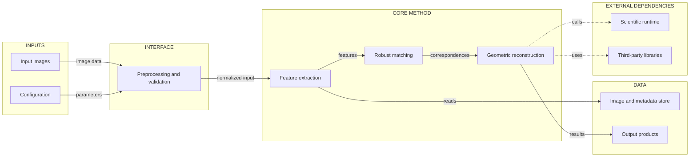
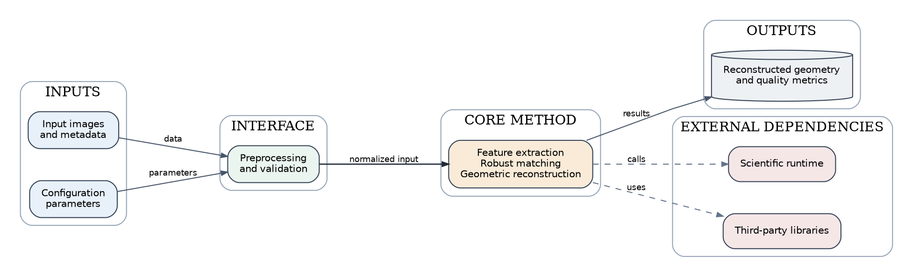

# 论文系统架构图绘制参考

本文档总结 `pyisis` 系统架构图的绘制方法，供论文框架图、系统架构图和方法流程图复用。

## 1. Figma、FigJam 与绘图技能

### Figma 是什么

Figma 是在线设计与协作工具，类似于 Adobe Illustrator、Visio 或 draw.io，但更适合多人协作和浏览器编辑。

### FigJam 是什么

FigJam 是 Figma 中的白板环境，适合流程图、系统架构图和团队协作讨论。

### `figma-generate-diagram` 是什么

`figma-generate-diagram` 是 Codex 的绘图技能，不是绘图库。它使用 Mermaid 描述图结构，并规定：

- 判断应该使用架构图、流程图还是时序图；
- 约束 Mermaid 节点、边和分层结构；
- 避免循环边、非法节点和难以布局的结构；
- 在 Figma/FigJam 工具可用时生成可编辑图形。

当前环境没有暴露 Mermaid MCP/FigJam 生成工具，因此本项目的 SVG/PDF 使用 Graphviz 渲染，Mermaid 文件作为可编辑源文件保留。

## 2. 论文框架图的设计原则

### 2.1 先明确图的结论

系统图应该回答一个明确问题，例如：

> 数据如何经过算法模块，最终产生输出？

不要把所有类、函数和文件都放入同一张图。只保留能支撑论文叙事的核心组件。

### 2.2 控制抽象层级

建议使用 3–5 个层级：

1. 输入或用户层；
2. 接口或预处理层；
3. 核心算法层；
4. 数据或外部依赖层；
5. 输出层。

文件级结构、类级结构、算法流程和部署架构不宜混在同一张图中，应拆成不同图件。

### 2.3 保持唯一主数据流

推荐从左到右组织：

```text
Input → Interface → Core method → Data / External dependency → Output
```

主流程使用实线、深色和较粗箭头；次要关系使用虚线、灰色和较细箭头。

### 2.4 颜色表达语义

| 颜色 | 含义 |
|---|---|
| 淡蓝色 | 用户、输入、应用 |
| 淡绿色 | 接口或数据适配层 |
| 淡橙色 | 核心算法 |
| 淡灰色 | 数据存储 |
| 淡红色 | 外部依赖或运行时 |

颜色数量最好控制在 4–5 种，并确保灰度打印时仍能区分。

### 2.5 出版输出

推荐同时保留：

- PDF：投稿主文件；
- SVG：后期编辑和网页使用；
- PNG：审稿系统预览或文档插图；
- Mermaid/Graphviz 源文件：后续修改。

Elsevier 通用图件规范推荐使用 PDF 等矢量格式，并要求成品文字保持约 7 pt，避免小于 6 pt：

- [Artwork formats checklist](https://www.prod.webpresence.elsevier.com/about/policies-and-standards/author/artwork-and-media-instructions/artwork-formats-checklist)
- [Artwork sizing](https://www.prod.webpresence.elsevier.com/about/policies-and-standards/author/artwork-and-media-instructions/artwork-sizing)

## 3. Mermaid 基本模板



### Mermaid 关键规则

- 使用 `flowchart LR`；
- 节点 ID 使用 camelCase；
- 每个节点放在明确的 `subgraph` 中；
- 主流程保持有向无环；
- 外部依赖使用虚线箭头；
- 节点标签尽量短；
- 不在标签里堆叠过多实现细节；
- 避免 emoji、HTML 标签和复杂转义字符。

## 4. Graphviz 基本模板



生成文件：

```bash
dot -Tpdf paper_architecture.dot -o paper_architecture.pdf
dot -Tsvg paper_architecture.dot -o paper_architecture.svg
dot -Tpng -Gdpi=600 paper_architecture.dot -o paper_architecture.png
```

## 5. 推荐工作流程

```text
阅读代码或方法
    ↓
提取输入、核心模块、输出和外部依赖
    ↓
确定主数据流
    ↓
选择 3–5 个语义层级
    ↓
编写 Mermaid 或 Graphviz 源文件
    ↓
生成 SVG/PDF/PNG
    ↓
检查字体、箭头、边界和灰度可读性
    ↓
在论文中单独提供 Figure caption
```

## 6. 当前 PyISIS 图件

- [Mermaid 源文件](pyisis-system-architecture.mmd)
- [PDF 图件](pyisis-system-architecture.pdf)
- [SVG 图件](pyisis-system-architecture.svg)
- [600 dpi PNG 图件](pyisis-system-architecture.png)
