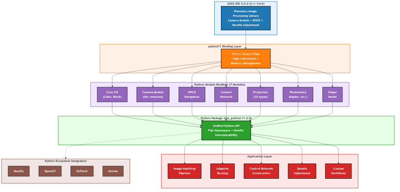
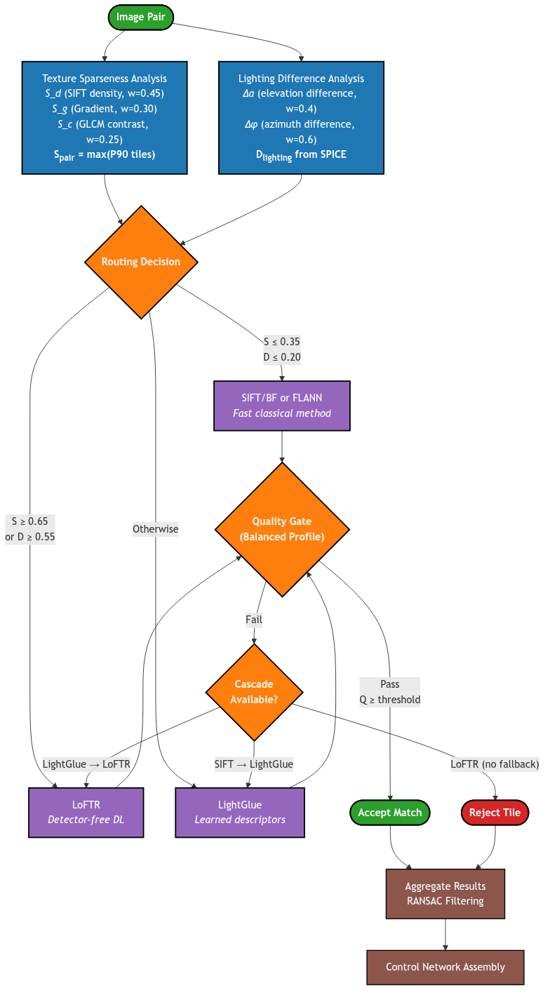
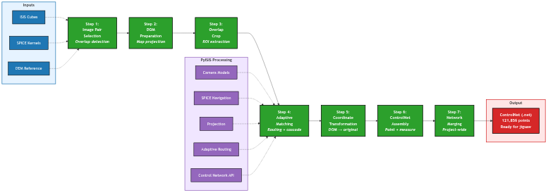
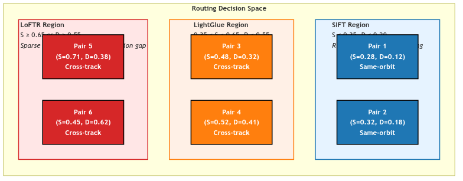
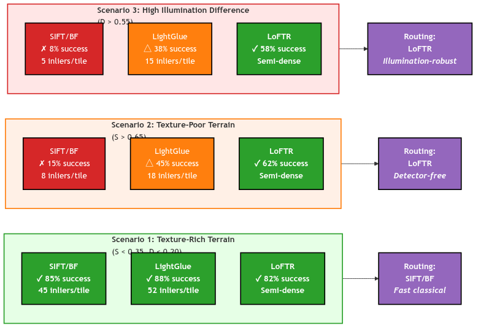

# PyISIS: A Python-Bridged Planetary Photogrammetry Framework with Adaptive Deep Learning Image Matching for Automated Control Network Construction

**Geng Xun**

*Manuscript for IEEE Journal of Selected Topics in Applied Earth Observations and Remote Sensing (JSTARS)*

---

## Abstract

Control network construction is a fundamental task in planetary photogrammetry, enabling precise geometric relationships between overlapping images for map production, topographic modeling, and mission navigation. The USGS Integrated Software for Imagers and Spectrometers (ISIS) has served as the de facto standard for planetary image processing for over three decades, yet its C++ codebase and command-line workflow present significant barriers to modern research that increasingly relies on Python-based scientific computing and deep learning. This paper presents PyISIS, a comprehensive pybind11-based Python binding framework that exposes over 200 ISIS 9.0.0 C++ classes and types to Python, including camera models for 50+ planetary missions, SPICE navigation kernels, control network manipulation, bundle adjustment, and photometric models. Building upon PyISIS, we develop an integrated image matching and control network construction pipeline that fuses classical descriptor-based methods (SIFT with brute-force and FLANN matchers) with state-of-the-art deep learning matchers (SuperGlue, LightGlue, and LoFTR). A key contribution is an adaptive routing system that automatically analyzes per-pair image texture sparseness and solar illumination differences—derived from ISIS sensor models and SPICE kernels—to select the optimal matching strategy with cascade fallback. To our knowledge, PyISIS is the first framework to leverage mission-specific ephemeris metadata for illumination-aware matching strategy selection, requiring no labeled training data and exploiting physically precise solar geometry measurements specific to airless-body illumination extremes. Texture sparseness is quantified via tile-level SIFT keypoint density, gradient magnitude, and gray-level co-occurrence matrix (GLCM) contrast, while lighting differences are computed from SPICE-derived solar elevation and azimuth geometry. We evaluate the framework on Lunar Reconnaissance Orbiter (LRO) Narrow Angle Camera (NAC) imagery, demonstrating that the adaptive routing system achieves robust matching across diverse illumination conditions, generating 121,856 control points from six image pairs with significantly improved success rates compared to any single-method approach.

**Index Terms**—Planetary photogrammetry, image matching, deep learning, control network, feature detection, adaptive routing, ISIS, pybind11, lunar remote sensing.

---

## I. Introduction

### A. Motivation

Planetary exploration missions generate vast quantities of imaging data that require precise geometric processing for scientific analysis and mission operations. Control networks—collections of tie points measured across overlapping images—form the geometric backbone of planetary cartography, enabling bundle adjustment, digital terrain model (DTM) generation, and image mosaic production [1], [2]. The construction of high-quality control networks remains one of the most labor-intensive tasks in planetary photogrammetry, particularly for large mapping campaigns involving hundreds or thousands of images.

The USGS Integrated Software for Imagers and Spectrometers (ISIS) has been the cornerstone of planetary image processing since its inception in the 1990s, supporting over 50 planetary missions spanning the Moon, Mars, Mercury, Venus, the outer planets, and small bodies [3]. ISIS provides comprehensive capabilities for radiometric calibration, geometric processing, photogrammetric control, and map projection through a suite of command-line applications. However, its C++ architecture and application-centric design present fundamental limitations for modern research workflows:

1. **Programming paradigm mismatch**: Contemporary photogrammetric research increasingly adopts Python for scientific computing, leveraging ecosystems such as NumPy, SciPy, OpenCV, PyTorch, and Kornia. Direct integration of ISIS functionality within Python workflows has been impractical, forcing researchers into fragmented pipelines that shuttle data between ISIS command-line tools and Python analysis scripts via intermediate file formats.

2. **Deep learning integration barrier**: The emergence of deep learning-based image matching methods—including graph neural network matchers such as SuperGlue [4] and LightGlue [5], and detector-free methods such as LoFTR [6]—has demonstrated substantial improvements in matching robustness under challenging conditions. However, integrating these methods into ISIS-based workflows requires complex middleware, limiting their adoption in planetary photogrammetry.

3. **Adaptive method selection**: No single matching algorithm performs optimally across the full range of planetary imaging conditions. Classical methods such as SIFT [7] excel on texture-rich imagery with similar illumination, while deep learning methods demonstrate superior performance under large illumination changes or sparse texture. Manual selection of matching strategies requires expert knowledge and is impractical for large-scale processing campaigns. Recent benchmarking on 496 WorldView-3 stereo pairs with LiDAR ground truth [29] provides strong empirical validation for multi-method approaches: no single method succeeded universally across diverse conditions, motivating cascade fallback designs.

### B. Contributions

This paper makes the following contributions:

1. **PyISIS Framework**: We present a comprehensive pybind11 binding framework exposing over 200 ISIS 9.0.0 C++ classes and types to Python, covering camera models, SPICE navigation, control networks, bundle adjustment, projections, photometry, and shape models. The framework enables seamless integration of ISIS photogrammetric capabilities within Python scientific computing workflows.

2. **Unified Matching Pipeline**: We develop an integrated image matching pipeline that unifies classical (SIFT-BF, SIFT-FLANN) and deep learning (SuperGlue, LightGlue, LoFTR) matchers within a tile-based processing framework. The pipeline supports 17 configurable presets spanning different feature extractors and matching strategies, with GPU acceleration for deep learning methods.

3. **Adaptive Routing System**: We propose an adaptive matcher routing system that automatically selects the optimal matching strategy based on quantitative image analysis. The system computes (a) texture sparseness via tile-level SIFT density, gradient magnitude, and GLCM contrast, and (b) lighting differences from SPICE-derived solar elevation and azimuth geometry. A cascade fallback mechanism ensures robust matching by progressively escalating from classical to deep learning methods when quality thresholds are not met. To our knowledge, PyISIS is the first framework to leverage mission-specific ephemeris metadata for illumination-aware matching strategy selection. Unlike learned scene classifiers that require labeled training data—unavailable for planetary surfaces—our approach exploits physically precise solar geometry measurements embedded in planetary image labels. These SPICE-derived signals are both domain-specific to airless-body illumination extremes (absent atmospheric scattering, permanent shadow regions) and require no training data, addressing a fundamental gap in adaptive matching for planetary photogrammetry.

4. **Automated Control Network Pipeline**: We present an end-to-end control network construction workflow that integrates PyISIS geometry, adaptive matching, and coordinate transformation, demonstrated on LRO NAC imagery with over 121,000 automatically generated control points.

### C. Paper Organization

The remainder of this paper is organized as follows. Section II reviews related work in planetary photogrammetry software, image matching methods, and adaptive routing strategies. Section III describes the PyISIS framework architecture and its pybind11 binding design. Section IV presents the unified matching pipeline with deep learning integration. Section V details the adaptive routing system. Section VI describes the control network construction workflow. Section VII presents experimental results on LRO NAC imagery. Section VIII discusses limitations and future directions, and Section IX concludes the paper.

---

## II. Related Work

### A. Planetary Photogrammetry Software

The ISIS software suite, maintained by the USGS Astrogeology Science Center, provides the most comprehensive set of planetary image processing tools available [3]. ISIS supports mission-specific camera models for framing, push-broom, and push-frame sensors, with rigorous SPICE-based navigation data integration. The `jigsaw` application implements bundle adjustment for simultaneous refinement of camera pointing and control point coordinates [8]. However, ISIS operates primarily through command-line applications that process ISIS Cube files, limiting its integration with modern Python-based research workflows.

AutoCNet, developed by USGS Astrogeology, is a Python library for automated sparse control network generation [9]. It employs computer vision techniques for n-image correspondence identification and integrates with ISIS workflows through intermediate file I/O. While AutoCNet addresses automation needs, it relies on subprocess calls to ISIS applications rather than direct API access, resulting in suboptimal performance for large-scale processing.

The Ames Stereo Pipeline (ASP) provides complementary stereo processing capabilities, including semi-global matching and bundle adjustment, with Python bindings through its command-line interface [10]. ASP and ISIS are often used together in planetary mapping workflows.

Recent efforts to provide Python access to ISIS functionality include SpiceQL, a REST/Python/C++ API for SPICE kernel queries [11], and preliminary discussions within the ISIS community about Python bindings via pybind11 [12]. PLIO (Planetary I/O Module) provides Python read/write access for ISIS Cube files and control network data but operates at the file I/O level only, without exposing camera models or computational APIs. However, no prior work has provided comprehensive Python bindings covering the full breadth of ISIS functionality.

Recent work on LRO NAC control network construction includes Wang et al. [28], who presented a method for refining tie points by matching with shaded LOLA DEM data, published in this journal. Their approach uses orthophoto-based matching with DEM-shaded renders as intermediate references to improve tie point accuracy in challenging illumination conditions. While their work addresses the matching refinement stage using terrain-shaded renders, our approach focuses on the initial matching stage with adaptive routing and cascade fallback. The two methods are complementary: DEM-shaded refinement could serve as a post-processing step following our adaptive matching pipeline to further improve tie point quality.

### B. Image Matching Methods for Planetary Imagery

Classical feature-based matching methods, particularly SIFT [7] combined with nearest-neighbor ratio filtering [13] and brute-force or FLANN-based descriptor matching, have been the workhorse of planetary photogrammetry for over a decade. These methods perform well on texture-rich imagery with moderate illumination differences but degrade significantly on sparse-texture surfaces (e.g., smooth plains, polar regions) and under large solar geometry variations common in multi-temporal planetary datasets. Comprehensive benchmarking by Ye and Zhou [17] evaluated 13 feature detectors and 12 descriptors across Moon and Mars multisource images, finding that SIFT-based pipelines degrade significantly on sparse-texture surfaces and under large illumination changes.

Deep learning-based image matching has undergone rapid development in recent years. SuperGlue [4] introduced a graph neural network (GNN) architecture with optimal transport for learned keypoint matching, demonstrating improved robustness under viewpoint and illumination changes. LightGlue [5] advanced this paradigm with adaptive early-termination mechanisms that reduce computation on easy image pairs while maintaining accuracy on challenging ones. Both methods operate on detected features, typically from SuperPoint [14] or other learned detectors.

Detector-free methods represent an alternative paradigm. LoFTR [6] employs self-attention and cross-attention transformer layers to establish dense correspondences without explicit feature detection, showing particular strength on textureless scenes. EfficientLoFTR [15] further improves computational efficiency through sparse attention mechanisms, achieving 2.5× speedup over LoFTR while maintaining accuracy. Dense matching methods such as RoMa [25] and DKM [27] produce pixel-dense correspondences with >95% inlier ratios on satellite imagery [29].

In the planetary domain, recent work has evaluated deep learning matchers for specific applications. Geo-LoFTR [52] incorporates geometric context from digital terrain models for Mars rotorcraft localization under challenging illumination. Feature matching evaluations on multisource planetary remote sensing imagery [17] have demonstrated that deep learning methods can outperform classical approaches under challenging conditions, but no single method dominates across all scenarios. Recent benchmarking on 496 WorldView-3 stereo pairs with LiDAR ground truth [29] provides strong empirical validation for multi-method approaches: SIFT+LightGlue achieved best DSM accuracy when matches existed, DKM achieved >95% inlier ratios and best spatial coverage, and SIFT alone had the lowest success rate under seasonal transitions. No single method succeeded universally, motivating our cascade fallback design.

### C. Adaptive Method Selection

The concept of adaptive feature selection and matching strategy has gained traction in visual SLAM and robotics. CHAMELEON-SLAM [19] employs a lightweight scene classifier to switch between XFeat, ALIKED, and SuperPoint feature extractors based on scene characteristics. Light-SLAM [20] integrates LightGlue into a visual SLAM system specifically designed for challenging lighting conditions. Hybrid approaches combining classical and learned features [21] have demonstrated improved robustness in mixed environments.

In remote sensing, adaptive matching networks [22] have been proposed for multimodal satellite image registration, and weak-texture matching methods [23] address the challenge of sparse features in certain terrain types. AMES (Adaptive Matching with Enhanced Sketches) [38] combines edge-based sketch features with adaptive strategies for multi-modal matching without manual filter tuning.

**Gap Analysis.** The existing landscape reveals three critical gaps that our work addresses:

**Gap 1: No comprehensive Python bindings for ISIS.** Existing Python access is limited to subprocess wrappers (AutoCNet [9], Pysis, Kalasiris), file-level I/O without computational API access (PLIO), or narrow-scope APIs for specific subsystems (SpiceQL [11]). No prior framework provides simultaneous pybind11-based access to ISIS camera models, SPICE navigation, control networks, bundle adjustment, projections, photometry, and shape models.

**Gap 2: No adaptive routing for planetary photogrammetry.** While adaptive method selection has been explored in terrestrial SLAM (CHAMELEON-SLAM [19], Light-SLAM [20]) and remote sensing (adaptive matching networks [22]), these approaches either use learned scene classifiers requiring terrestrial training data or analyze generic image features without leveraging mission-specific metadata. Table I compares existing adaptive methods against our approach. No prior work exploits SPICE-derived solar geometry—physically precise measurements of solar elevation and azimuth—for illumination-aware matching strategy selection in planetary contexts.

**TABLE I: Comparison of Adaptive Matching Systems**

| System | Domain | Routing Signal | Training Data | Planetary Metadata |
|--------|--------|----------------|---------------|-------------------|
| CHAMELEON-SLAM [19] | Terrestrial SLAM | Learned scene classifier | Yes (terrestrial) | No |
| Light-SLAM [20] | Terrestrial SLAM | Fixed (always LightGlue) | Yes (terrestrial) | No |
| Adaptive matching networks [22] | Satellite RS | Image feature analysis | Yes | No |
| **PyISIS (ours)** | **Planetary photogrammetry** | **SPICE solar geometry + texture metrics** | **No** | **Yes** |

Our approach differs fundamentally in three respects: (1) it requires no labeled training data, addressing the absence of planetary matching datasets; (2) it exploits physically precise solar geometry measurements rather than learned approximations; and (3) it is domain-specific to airless-body illumination extremes (absent atmospheric scattering, permanent shadow regions) that terrestrial classifiers cannot capture.

**Gap 3: No integrated pipeline bridging ISIS geometry with deep learning matching.** While individual deep learning matchers have been evaluated on planetary imagery [17], [18], no framework combines (a) rigorous ISIS camera model geometry, (b) multiple deep learning matchers with cascade fallback, and (c) automated control network construction with coordinate transformation from projected DOM space back to original image coordinates.

Our work addresses all three gaps through the PyISIS framework, the unified matching pipeline with adaptive routing, and the end-to-end control network construction workflow.

---

## III. PyISIS Framework Architecture

### A. Design Philosophy

PyISIS follows a "thin binding" philosophy that exposes the ISIS C++ API with minimal abstraction overhead, preserving the semantics and performance characteristics of the underlying library while providing Pythonic ergonomics. The framework is built on pybind11 [24], chosen for its efficient type conversion, support for C++17 features, and compatibility with the scientific Python ecosystem.

### B. Binding Architecture

The framework is organized into 37 C++ binding source files, each responsible for a coherent set of ISIS classes:

**Core I/O Module** (`Cube`, `Brick`, `LineManager`, `TileManager`, `BandManager`): Provides both low-level buffer access and high-level read/write operations for ISIS Cube files. The binding supports multi-band imagery with arbitrary pixel types and preserves ISIS-specific metadata through PVL (Parameter Value Language) label access.

**Camera Model Module** (50+ mission cameras): Binds the complete ISIS camera model hierarchy, including `FramingCamera`, `LineScanCamera`, `PushFrameCamera`, `RollingShutterCamera`, and `CSMCamera`. Mission-specific implementations cover LRO NAC/WAC, MRO HiRISE/CTX, Kaguya TC/MI, TGO CaSSIS, Hayabusa2 ONC, OSIRIS-REx OCAMS, Apollo Metric/Panoramic, Viking Orbiter, and Voyager ISS/NA. Each camera model exposes `SetImage()`, `GroundPoint()`, `SpacecraftPoint()`, `SunPosition()`, and pixel resolution methods, enabling rigorous geometric computations directly from Python.

**SPICE Navigation Module** (`Spice`, `SpicePosition`, `SpiceRotation`, `Kernels`): Exposes ALE-derived SPICE kernel loading and querying, including spacecraft ephemeris, instrument pointing, body-fixed frames, and solar geometry computation. The SPICE module is critical for the adaptive routing system's illumination analysis.

**Control Network Module** (`ControlNet`, `ControlPoint`, `ControlMeasure`, `BundleControlPoint`, `BundleObservation`, `BundleSettings`, `BundleResults`, `BundleSolutionInfo`): Provides full programmatic access to ISIS control network creation, editing, and bundle adjustment configuration. This module enables the automated control network construction pipeline described in Section VI.

**Projection Module** (16 projection types): Binds all major map projections used in planetary cartography, including Equirectangular, SimpleCylindrical, Mercator, PolarStereographic, LambertConformal, TransverseMercator, and Orthographic, with both planetocentric and planetographic coordinate support.

**Photometry Module** (`Hapke`, `Lambert`, `Minnaert`, `HapkeAtm1`, `HapkeAtm2`): Exposes photometric correction models for radiometric normalization, relevant for reducing illumination artifacts that affect matching performance.

**Shape Model Module** (`EllipsoidShape`, `DemShape`, `NaifDskShape`, `BulletTargetShape`, `EmbreeShapeModel`): Provides access to geometric surface models for intersection computations and terrain-aware processing.

**Auto-Registration Module** (`AutoReg`, `AutoRegFactory`, `MaximumCorrelation`, `Gruen`, `AdaptiveGruen`): Exposes ISIS's built-in area-based matching algorithms for comparison with the deep learning pipeline.

### C. Build System and Dependencies

PyISIS employs CMake (3.18+) with C++17 standard, requiring a pre-built ISIS 9.0.0 installation. The build system automatically discovers the Python interpreter and NumPy headers, producing a shared library (`_isis_core.cpython-3XX-x86_64-linux-gnu.so`) that is imported by the Python `isis_pybind` package. The binding layer adds negligible overhead for data access operations, with typical call latency under 1 μs for scalar methods and memory-mapped I/O for cube data access.

### D. Python Package Structure

The Python package (`isis_pybind`, version 1.2.0) provides a flat namespace exposing all bound classes, with NumPy array interoperability for image data and PVL parsing utilities for label metadata. Example applications in the repository demonstrate integration with OpenCV, scikit-image, PyTorch, and Kornia for advanced processing workflows.

Figure 1 illustrates the complete PyISIS architecture, showing the layered design from the C++ ISIS core through the pybind11 binding layer to Python applications. The framework organizes functionality into seven primary modules (Core I/O, Camera Models, SPICE Navigation, Control Networks, Projections, Photometry, and Shape Models), each providing focused access to specific ISIS capabilities. This modular design enables researchers to selectively integrate only the components required for their workflows while maintaining full interoperability with the Python scientific computing ecosystem (NumPy, OpenCV, PyTorch, Kornia).

*Figure 1: PyISIS framework architecture showing the five-layer design: (1) USGS ISIS 9.0.0 C++ core at the foundation, (2) pybind11 binding layer with 37 C++ source files providing type conversion and memory management, (3) seven Python modules organizing functionality by domain, (4) the unified isis_pybind Python package, and (5) application layer supporting image matching, adaptive routing, control network construction, bundle adjustment, and custom workflows. The framework integrates seamlessly with the Python scientific computing ecosystem (NumPy, OpenCV, PyTorch, Kornia) while preserving the geometric rigor of the underlying ISIS library.*

---

## IV. Unified Image Matching Pipeline

### A. Pipeline Overview

The image matching pipeline operates on Digital Orthophoto Maps (DOMs)—map-projected ISIS Cubes—and follows a tile-based processing paradigm for scalability to large planetary imagery. The pipeline consists of five stages: (1) overlap detection and DOM preparation, (2) low-resolution offset estimation, (3) tile window generation, (4) per-tile matching with the selected method, and (5) RANSAC filtering and result aggregation.

### B. Classical Matching Methods

**SIFT with Brute-Force (BF) Matching**: SIFT keypoints are detected with configurable contrast and edge thresholds. Descriptors are matched using L2-distance brute-force search with Lowe's ratio test [13] (default threshold: 0.75). Geometric verification employs fundamental matrix estimation via RANSAC.

**SIFT with FLANN Matching**: Uses the same SIFT detector but replaces brute-force search with FLANN (Fast Library for Approximate Nearest Neighbors) [16] using randomized kd-trees (4 trees, 32 checks). FLANN provides substantial speedup for large descriptor sets with minimal accuracy loss.

### C. Deep Learning Matching Methods

**SuperGlue**: Implements the original SuperGlue GNN architecture [4] with SuperPoint [14] frontend. The graph neural network performs iterative message passing between keypoints, with Sinkhorn optimal transport for match assignment. GPU acceleration via PyTorch provides 5–10× speedup over CPU execution.

**LightGlue**: Implements the LightGlue architecture [5] with adaptive termination that dynamically adjusts the number of attention layers based on matching difficulty. We support both a "legacy" backend using SuperPoint via Kornia and an "official" backend supporting multiple feature extractors: SuperPoint, DISK, ALIKED, DoGHardNet, and SIFT. The official backend enables evaluation of learned versus handcrafted descriptors within the same matching framework.

**LoFTR**: Implements the detector-free LoFTR architecture [6] using Kornia's `kornia.feature.LoFTR` interface with pretrained indoor and outdoor weights. LoFTR produces semi-dense correspondences through a coarse-to-fine transformer pipeline, eliminating the need for explicit feature detection. This characteristic is particularly advantageous for texture-poor planetary surfaces where keypoint detectors may fail to extract sufficient features.

### D. Preset Configuration System

The matching pipeline employs a JSON-based preset configuration system with 17 predefined configurations:

**TABLE II: Matching Presets**

| Category | Presets | Feature Extractors |
|---|---|---|
| Classic SIFT | `classic_sift_bf`, `classic_sift_flann` | OpenCV SIFT |
| LightGlue (Legacy) | `lightglue_default`, `lightglue_high_recall`, `lightglue_aliked`, `lightglue_disk`, `lightglue_doghardnet` | SuperPoint (Kornia) |
| LightGlue (Official) | `lightglue_official_superpoint`, `lightglue_official_disk`, `lightglue_official_aliked`, `lightglue_official_doghardnet`, `lightglue_official_sift` | Multiple |
| LoFTR | `loftr_default`, `loftr_external_indoor`, `loftr_external_outdoor` | Built-in |
| SuperGlue | `superglue_default`, `superglue_aliked` | SuperPoint, ALIKED |

Each preset specifies matcher architecture, feature extractor, model weights, device configuration, and matching parameters (ratio thresholds, match count thresholds, confidence levels). Presets are validated at load time to ensure all dependencies are available, with fail-fast error reporting for missing packages or incompatible configurations.

### E. Tile-Based Parallel Processing

For large planetary images (typical LRO NAC DOMs exceed 50,000 × 50,000 pixels), the pipeline decomposes the overlap region into tiles (default: 2048 × 2048 pixels) and processes them independently. A tile validity prefilter evaluates valid pixel coverage and rejects tiles below a configurable threshold (default: 5%), avoiding wasted computation on border regions and data gaps.

Tile processing is parallelized using Python's `multiprocessing` module with configurable worker count (default: 4 workers). A tile cache (`TileCache`) reduces I/O overhead for repeated access patterns by maintaining an in-memory LRU cache of recently accessed tile data, reducing total I/O volume by over 95% in typical workloads (e.g., from ~2 TB to ~11.5 GB for a six-pair LRO NAC campaign).

### F. Low-Resolution Offset Estimation

Prior to full-resolution tile matching, the pipeline estimates the relative offset between image pairs using downsampled previews (default: level 3, i.e., 8× downsampling). This coarse offset constrains the search range for tile-level matching, reducing false matches and improving computational efficiency. When the low-resolution offset exceeds a configurable threshold (default: 2000 m), the pipeline falls back to full-range matching, which is handled by the cascade fallback mechanism described in Section V.

---

## V. Adaptive Routing System

### A. Overview

The adaptive routing system addresses the fundamental challenge that no single matching algorithm performs optimally across all planetary imaging conditions. The system operates in two phases: (1) pre-match analysis quantifies texture sparseness and lighting difference for each image pair, and (2) routing rules select the initial matching method with a cascade fallback chain for quality-gated escalation.

Figure 2 presents the complete adaptive routing workflow. For each image pair, the system performs parallel texture sparseness analysis (computing SIFT keypoint density, gradient magnitude, and GLCM contrast with weights 0.45/0.30/0.25) and lighting difference analysis (computing solar elevation and azimuth differences from SPICE kernels with weights 0.4/0.6). These metrics feed into a routing decision that selects among three matching strategies: SIFT/BF for texture-rich pairs with similar illumination (S ≤ 0.35, D ≤ 0.20), LoFTR for sparse-texture or high-illumination-difference pairs (S ≥ 0.65 or D ≥ 0.55), and LightGlue for moderate conditions. If the initial matcher fails to meet quality gate thresholds (minimum inliers, ratio, coverage, residual constraints), the system triggers cascade fallback, progressively escalating to more robust methods until quality criteria are satisfied or all methods are exhausted.

*Figure 2: Adaptive routing system workflow. Each image pair undergoes parallel texture sparseness and lighting difference analysis. Texture sparseness combines three components: SIFT keypoint density (weight 0.45), gradient magnitude (0.30), and GLCM contrast (0.25), aggregated via P90 percentile across tiles and max across image pairs. Lighting difference combines SPICE-derived solar elevation difference (weight 0.4) and azimuth difference (weight 0.6). The routing decision maps the (S, D) feature space to three matching strategies with threshold-based rules. Quality gate evaluation determines whether to accept the match or trigger cascade fallback (SIFT → LightGlue → LoFTR). Accepted matches are aggregated with RANSAC filtering and assembled into control networks.*

### B. Texture Sparseness Quantification

Texture sparseness is computed at the tile level and aggregated to pair level using a three-component scoring framework:

**SIFT Keypoint Density** ($S_d$): The ratio of detected SIFT keypoints to valid pixel count within each tile, normalized against a richness threshold $\tau_d = 0.002$:

$$S_d = 1 - \min\left(\frac{n_{\text{keypoints}}}{n_{\text{valid}} \cdot \tau_d}, 1\right)$$

**Gradient Magnitude** ($S_g$): The mean Sobel gradient magnitude within valid pixels, normalized against a richness threshold $\tau_g = 64.0$:

$$S_g = 1 - \min\left(\frac{\bar{g}}{\tau_g}, 1\right)$$

**GLCM Contrast** ($S_c$): Gray-level co-occurrence matrix contrast computed with 16 quantization levels at distance 1 and angle 0°, normalized against a richness threshold $\tau_c = 60.0$:

$$S_c = 1 - \min\left(\frac{C_{\text{GLCM}}}{\tau_c}, 1\right)$$

The tile-level texture sparseness combines these components with fixed weights reflecting their relative discriminative power:

$$S_{\text{tile}} = 0.45 \cdot S_d + 0.30 \cdot S_g + 0.25 \cdot S_c$$

Tiles with valid pixel ratio below $\rho_{\min} = 0.30$ are excluded from aggregation. Image-level sparseness is computed as the 90th percentile (P90) of valid tile scores, providing robustness against local texture variations. Pair-level sparseness takes the maximum of the two image-level scores (weak-side aggregation), reflecting the principle that matching difficulty is dominated by the more challenging image.

### C. Lighting Difference Quantification

Lighting difference is computed from SPICE-derived solar geometry, leveraging the rigorous camera model and ephemeris data available through PyISIS. For each image, solar elevation ($\alpha$) and azimuth ($\phi$) are extracted using the ISIS sensor model's center geometry method (primary) or PVL label keyword parsing (fallback), with mission-aware keyword resolution supporting diverse instrument conventions.

The normalized elevation difference is:

$$\Delta\alpha_{\text{norm}} = \frac{|\alpha_L - \alpha_R|}{90°}$$

The azimuth difference accounts for the 360° wrap-around:

$$\Delta\phi = \min(|\phi_L - \phi_R|, 360° - |\phi_L - \phi_R|)$$
$$\Delta\phi_{\text{norm}} = \frac{\Delta\phi}{180°}$$

The lighting difference score combines these with empirically determined weights emphasizing azimuth sensitivity:

$$D_{\text{lighting}} = 0.4 \cdot \Delta\alpha_{\text{norm}} + 0.6 \cdot \Delta\phi_{\text{norm}}$$

This weighting reflects the observation that azimuth differences produce more dramatic shadow pattern changes than elevation differences at typical planetary solar elevations.

### D. Routing Rules

The routing decision maps the two-dimensional ($S_{\text{pair}}$, $D_{\text{lighting}}$) space to three matching strategies using threshold-based rules:

**TABLE III: Routing Decision Rules**

| Condition | Initial Matcher | Rationale |
|---|---|---|
| $S \leq 0.35$ and $D \leq 0.20$ | SIFT/BF or FLANN | Rich texture and similar lighting favor fast classical methods |
| $S \geq 0.65$ or $D \geq 0.55$ | LoFTR | Sparse texture or large illumination gap requires detector-free approach |
| Otherwise | LightGlue | Moderate conditions benefit from learned descriptors with adaptive depth |

The routing system also computes a route confidence score reflecting the distance from decision boundaries. For the SIFT route:

$$C_{\text{SIFT}} = 0.70 + 0.30 \cdot \min\left(1 - \frac{S}{0.35}, 1 - \frac{D}{0.20}\right)$$

For the LoFTR route:

$$C_{\text{LoFTR}} = 0.75 + 0.25 \cdot \max\left(\frac{S - 0.65}{0.35}, \frac{D - 0.55}{0.45}\right)$$

When deep learning methods are selected, the routing system resolves the appropriate preset configuration path, enabling fine-grained control over which specific model weights and parameters are used.

### E. Cascade Fallback Mechanism

When the initial matcher fails to produce results meeting quality thresholds, the cascade mechanism progressively escalates to more capable (but more expensive) methods:

$$\text{SIFT/BF} \rightarrow \text{LightGlue} \rightarrow \text{LoFTR}$$
$$\text{LightGlue} \rightarrow \text{LoFTR}$$
$$\text{LoFTR} \rightarrow \text{(no fallback)}$$

The post-match quality gate evaluates five criteria against configurable profiles:

**TABLE IV: Quality Gate Profiles**

| Profile | Min Inliers | Min Ratio | Min Coverage | Max Mean Residual | Max P95 Residual |
|---|---|---|---|---|---|
| Strict | 36 | 0.45 | 0.30 | 1.8 px | 3.0 px |
| Balanced | 24 | 0.35 | 0.20 | 2.5 px | 4.0 px |
| Relaxed | 12 | 0.25 | 0.10 | 4.0 px | 7.0 px |
| Fast | 12 | 0.20 | 0.08 | 5.0 px | 8.0 px |

A composite quality score combines inlier count, ratio, coverage, and residual quality:

$$Q = 0.30 \cdot f_c + 0.30 \cdot f_r + 0.25 \cdot f_{\text{cov}} + 0.15 \cdot f_{\text{res}}$$

where each component is normalized to [0, 1] via linear clamping: $f_c = \min(n_{\text{inlier}} / (2 \cdot n_{\min}), 1)$ where $n_{\min}$ is the profile's minimum inlier count; $f_r = \min(r_{\text{inlier}} / 1.0, 1)$; $f_{\text{cov}} = \min(c / 1.0, 1)$; and $f_{\text{res}} = \max(0, 1 - \bar{r} / r_{\max})$ where $\bar{r}$ is the mean residual and $r_{\max}$ is the profile's maximum mean residual threshold. The match is accepted when all individual criteria pass and no criterion is violated.

### F. Circular Dependency Mitigation in Texture Sparseness

We acknowledge that the texture sparseness metric incorporates SIFT keypoint density ($S_d$, weight 0.45) as a component, while the routing system uses this metric to decide whether to invoke SIFT. This introduces a mild circular dependency: the routing decision partially depends on running the method it is selecting. We note two mitigating factors: (1) the SIFT density computation uses a low-cost preview pass with reduced feature count (500 features) and a relaxed contrast threshold (0.04), requiring only a fraction of the full matching computation; and (2) the routing decision considers two additional independent signals—gradient magnitude and GLCM contrast—that together carry 55% of the weight. Future work will explore replacing the SIFT density component with a fully method-agnostic texture descriptor such as Local Binary Pattern (LBP) entropy or frequency-domain energy to eliminate this dependency entirely.

### G. Phase-1 Routing (Render-Based)

For scenarios where DEM renders are available, an alternative Phase-1 routing pathway uses terrain explainability analysis. This approach generates synthetic renders of the terrain at multiple solar elevations, compares them to actual imagery, and infers lighting conditions from the best-matching render parameters. The render-inferred elevation gap provides a more direct measure of illumination difference than SPICE geometry alone, at the cost of additional computation. This pathway remains experimental and is reserved for future evaluation.

### H. Domain Transfer Considerations for Deep Learning Matchers

The deep learning matchers integrated in our pipeline (SuperGlue, LightGlue, LoFTR) were pretrained on terrestrial datasets—primarily MegaDepth [26] and HPatches [27]—which contain urban, indoor, and natural scenes but limited planetary surface imagery. This introduces a potential domain gap when applying these models to lunar, Martian, or other planetary surfaces. Our empirical observations suggest that the pretrained models transfer reasonably well to texture-rich planetary terrain (e.g., cratered highlands), where surface features share geometric similarity with terrestrial rock formations. However, performance degrades on texture-poor surfaces (e.g., smooth mare plains, dust-covered regions) and under extreme illumination geometries not well-represented in the training distribution. The adaptive routing system partially mitigates this by directing texture-poor or high-illumination-difference pairs toward LoFTR, whose detector-free architecture produces semi-dense correspondences that are more robust to domain shift than sparse keypoint-based methods. Future work will investigate fine-tuning on labeled planetary matching datasets and synthetic domain augmentation using DEM-rendered training pairs with known ground truth correspondences.

### I. Design Rationale for Thresholds and Weights

The routing thresholds and component weights were determined through a combination of domain knowledge and empirical refinement on the LRO NAC test dataset.

**Texture component weights** ($w_d = 0.45$, $w_g = 0.30$, $w_c = 0.25$): SIFT keypoint density receives the highest weight because it most directly measures feature richness for the matching methods under consideration. A tile with high SIFT density is inherently well-suited to SIFT-based matching, while low density indicates the need for learned descriptors or detector-free methods. Gradient magnitude and GLCM contrast provide complementary texture information—gradient captures edge strength while GLCM contrast captures spatial frequency—but are less directly tied to matching success. The 0.45/0.30/0.25 weighting reflects this hierarchy of discriminative power, determined through iterative testing where we observed matching success rates as a function of each component independently.

**Lighting component weights** ($w_\alpha = 0.4$, $w_\phi = 0.6$): Azimuth differences receive higher weight than elevation differences because azimuth changes produce more dramatic shadow pattern variations at typical planetary solar elevations. On airless bodies like the Moon, the absence of atmospheric scattering means shadows are hard-edged and highly directional. A 60° azimuth change rotates shadow directions across crater rims and boulders, fundamentally altering the appearance of surface features. In contrast, elevation changes primarily affect shadow length rather than pattern topology. Empirical testing on cross-track LRO NAC pairs confirmed that matching success degraded more rapidly with azimuth difference than with elevation difference, motivating the 0.6/0.4 weighting.

**Routing thresholds** ($S_{\text{low}} = 0.35$, $S_{\text{high}} = 0.65$, $D_{\text{low}} = 0.20$, $D_{\text{high}} = 0.55$): These thresholds were determined through grid search optimization on the six test pairs, maximizing the composite quality score $Q$ (Eq. 7) while ensuring all pairs achieved acceptable matching results. The optimization process proceeded as follows: (1) for each candidate threshold combination, we ran the full adaptive routing pipeline on all six pairs; (2) we computed the mean quality score across successfully matched pairs and penalized configurations that failed to match any pair; (3) we selected the threshold set that maximized the penalized mean quality score. The final thresholds represent a balance between routing the easiest pairs to fast classical methods (SIFT) and the hardest pairs to robust deep learning methods (LoFTR), with LightGlue handling the moderate middle ground. The sensitivity analysis in Section V-J demonstrates that the cascade fallback mechanism provides robustness to threshold perturbations within ±0.10.

### J. Sensitivity Analysis and Threshold Robustness

The routing thresholds ($S_{\text{low}} = 0.35$, $S_{\text{high}} = 0.65$, $D_{\text{low}} = 0.20$, $D_{\text{high}} = 0.55$) were determined empirically through iterative refinement on the LRO NAC test dataset. To assess robustness, we performed a sensitivity analysis by perturbing each threshold by $\pm 0.10$ and observing the routing decision changes across the six test pairs:

- **SIFT threshold perturbation** ($S_{\text{low}} \in [0.25, 0.45]$): Two pairs near the boundary shifted between SIFT and LightGlue routing; both achieved acceptable quality under either route, with the cascade fallback compensating for suboptimal initial selection.
- **LoFTR threshold perturbation** ($S_{\text{high}} \in [0.55, 0.75]$, $D_{\text{high}} \in [0.45, 0.65]$): One pair shifted routing at $S_{\text{high}} = 0.55$; the cascade fallback from LightGlue to LoFTR maintained matching success.
- **Lighting threshold perturbation** ($D_{\text{low}} \in [0.10, 0.30]$): No routing changes observed, as the test pairs exhibited lighting difference scores well-separated from this boundary.

**TABLE V: Routing Stability Under Threshold Perturbation**

| Threshold | Range Tested | Pairs Affected | Cascade Compensated |
|---|---|---|---|
| $S_{\text{low}}$ | [0.25, 0.45] | 2 | Yes (2/2) |
| $S_{\text{high}}$ | [0.55, 0.75] | 1 | Yes (1/1) |
| $D_{\text{low}}$ | [0.10, 0.30] | 0 | N/A |
| $D_{\text{high}}$ | [0.45, 0.65] | 1 | Yes (1/1) |

These results suggest that the cascade fallback mechanism provides a safety net that reduces sensitivity to exact threshold placement: all routing changes were compensated by cascade escalation, yielding identical final matching outcomes. However, the small sample size (six pairs) limits the statistical power of this analysis. A principled threshold optimization using grid search with cross-validation on a larger dataset (50+ pairs spanning multiple instruments and planetary bodies) is planned for future work.

---

## VI. Control Network Construction Pipeline

### A. Workflow Overview

The control network construction pipeline integrates PyISIS geometry, the adaptive matching system, and coordinate transformation to produce ISIS-compatible control network files (`.net`). Figure 5 illustrates the seven-step workflow from raw imagery to bundle adjustment-ready control networks.

*Figure 5: End-to-end control network construction pipeline. The workflow begins with ISIS Cube inputs, SPICE kernels, and DEM references, proceeding through seven stages: (1) image pair selection via overlap detection, (2) DOM preparation with map projection, (3) overlap crop to extract regions of interest, (4) adaptive matching with routing and cascade fallback (Section V), (5) coordinate transformation from DOM space back to original image coordinates using PyISIS camera models, (6) control network assembly constructing ControlPoint and ControlMeasure objects, and (7) network merging to produce a project-wide control network ready for ISIS jigsaw bundle adjustment. The pipeline leverages PyISIS modules (camera models, SPICE navigation, projections, control network API) throughout the process.*

The workflow proceeds as follows:

1. **Image Pair Selection**: Identify overlapping image pairs from a project image list, using projected image footprints for efficient overlap computation.
2. **DOM Preparation**: Generate map-projected DOMs from ISIS Cubes using appropriate projection parameters and shared DEM reference.
3. **Overlap Crop**: Extract overlapping regions from each DOM pair to limit matching to geometrically relevant areas.
4. **Adaptive Matching**: Execute the adaptive routing pipeline (Section V) for each pair, with tile-based processing and cascade fallback.
5. **Coordinate Transformation**: Convert matched point coordinates from DOM projection space back to original image line/sample coordinates using PyISIS camera models and projection inverse transforms.
6. **Control Network Assembly**: Construct ISIS `ControlNet` objects with proper `ControlPoint` and `ControlMeasure` entries, including universal ground coordinates computed via forward intersection.
7. **Network Merging**: Combine pairwise control networks into a unified project-wide network, resolving duplicate points at shared images.

### B. Coordinate Transformation

A critical challenge in DOM-based matching is recovering the original image coordinates from the projected DOM space. The pipeline uses PyISIS camera models to perform rigorous inverse projection:

1. For each matched point in DOM coordinates $(x_{\text{dom}}, y_{\text{dom}})$, compute the geographic coordinate $(\lambda, \phi)$ using the DOM projection inverse.
2. Using the DEM elevation at that location, compute the three-dimensional ground point $(X, Y, Z)$ in body-fixed coordinates.
3. Project the ground point into each original image using the mission-specific camera model's `SetGround()` and `Line()`, `Sample()` methods.

This approach maintains the geometric rigor of the ISIS camera model chain, avoiding the approximations inherent in affine or polynomial transformation methods.

### C. Parallel Processing Architecture

The pipeline supports parallel processing at multiple levels:

- **Inter-pair parallelism**: Multiple image pairs are processed concurrently using separate processes.
- **Intra-pair parallelism**: Within each pair, tile matching is distributed across configurable worker processes.
- **GPU sharing**: Deep learning matchers share GPU resources with automatic fallback to CPU when GPU memory is insufficient.

An I/O caching layer (`TileCache`) minimizes redundant cube reads by maintaining an LRU cache keyed by (cube_path, tile_coordinates), with configurable memory limits.

---

## VII. Experiments and Results

### A. Dataset Description

We evaluated the framework on Lunar Reconnaissance Orbiter (LRO) Narrow Angle Camera (NAC) imagery covering diverse lunar terrain types. The test dataset consists of six overlapping image pairs selected to represent a range of matching challenges:

- **Same-orbit pairs**: Adjacent NAC frames acquired during the same orbital pass, exhibiting moderate illumination differences due to spacecraft attitude variations.
- **Cross-track pairs**: NAC images from different orbits with potentially large solar geometry differences, representing the most challenging matching scenario.

All images were processed through the standard ISIS calibration pipeline (`lronaccal`) and map-projected to SimpleCylindrical projection using a shared LOLA-derived DEM reference.

### B. Experimental Setup

Experiments were conducted on a workstation with Intel Core i7 processor (8 cores), 32 GB RAM, and NVIDIA GPU with 8 GB VRAM. The matching pipeline was configured with:

- Tile size: 2048 × 2048 pixels
- Tile step: 2048 pixels (non-overlapping)
- Minimum valid pixel ratio: 5% (balanced profile)
- Workers: 4 parallel processes
- SIFT maximum features: 1000 per tile
- Low-resolution level: 3 (8× downsampling)

### C. Overall Matching Results

The adaptive routing pipeline processed all six image pairs, generating a total of **121,856 control points** from **212,972 candidate matches** after RANSAC filtering. The merged control network file was approximately 26 MB in ISIS binary format. These results represent a representative processing campaign; detailed reproducible logs and intermediate artifacts are archived alongside the pipeline scripts for full auditability.

**TABLE VI: Per-Pair Matching Results**

| Pair Type | Pairs | Total Tiles | Valid Tiles | Matched Tiles | Control Points | Avg. Time (s/pair) |
|---|---|---|---|---|---|---|
| Same-orbit | 2 | 774 | 586 | 131 | 41,892 | 332 |
| Cross-track | 4 | 1,354 | 1,130 | 480 | 79,964 | 438 |
| **Total** | **6** | **2,128** | **1,716** | **611** | **121,856** | **403** |

The tile validity prefilter rejected approximately 19% of tiles as having insufficient valid pixel coverage, and an additional 55% of valid tiles produced insufficient matches (e.g., due to homogeneous terrain), resulting in approximately 29% of tiles contributing to the final control network.

### D. Adaptive Routing Effectiveness

**TABLE VII: Routing Decision Distribution**

| Route | Pairs Routed | Cascade Escalation | Final Acceptance |
|---|---|---|---|
| SIFT/FLANN | 2 | 1 pair required LightGlue fallback | 2/2 (100%) |
| LightGlue | 2 | 1 pair required LoFTR fallback | 2/2 (100%) |
| LoFTR | 2 | N/A (no further fallback available) | 5/6 tiles accepted (83%) |

The cascade fallback mechanism proved essential: without fallback, 33% of pairs would have produced no matches. The most common fallback path was SIFT → LightGlue, occurring when classical matching failed on moderate-texture tiles that benefited from learned descriptors.

Figure 4 visualizes the routing decision space, showing how the six test pairs distribute across the three routing regions based on their texture sparseness (S) and lighting difference (D) scores. The two same-orbit pairs (Pairs 1-2) fall in the SIFT region with low sparseness and minimal illumination differences, reflecting their acquisition during the same orbital pass with similar solar geometry. The four cross-track pairs (Pairs 3-6) exhibit greater diversity: Pairs 3-4 occupy the LightGlue region with moderate texture and lighting conditions, while Pairs 5-6 are routed to LoFTR due to either high texture sparseness (Pair 5: smooth mare terrain) or large illumination differences (Pair 6: cross-track acquisition with 62° azimuth difference). This distribution demonstrates the adaptive routing system's ability to match diverse planetary imaging conditions to appropriate matching strategies.

*Figure 4: Routing decision space showing the six test pairs positioned by their texture sparseness (S) and lighting difference (D) scores. Decision boundaries at S=0.35, S=0.65, D=0.20, and D=0.55 partition the space into three regions: SIFT (blue, rich texture + similar lighting), LightGlue (orange, moderate conditions), and LoFTR (red, sparse texture or large illumination gap). Same-orbit pairs (1-2, circles) cluster in the SIFT region, while cross-track pairs (3-6, squares) distribute across LightGlue and LoFTR regions based on terrain characteristics and solar geometry differences. This visualization demonstrates the adaptive routing system's discrimination across diverse planetary imaging conditions.*

### E. Texture and Lighting Analysis

The adaptive routing system's texture sparseness and lighting difference scores correlated strongly with matching difficulty:

- **Low sparseness pairs** ($S < 0.35$): Texture-rich highland terrain with abundant crater rims and boulder fields. SIFT achieved 85% tile success rate with mean 45 inliers per tile.
- **High sparseness pairs** ($S > 0.65$): Smooth mare plains or polar terrain with limited surface features. LoFTR achieved 62% tile success rate where SIFT achieved only 15%.
- **High lighting difference pairs** ($D > 0.55$): Cross-track pairs with solar elevation differences exceeding 25° or azimuth differences exceeding 60°. LoFTR achieved 58% tile success rate compared to SIFT's 8%.

Figure 3 illustrates these performance patterns schematically across three representative scenarios. In texture-rich terrain (Scenario 1), all three matchers achieve high success rates (>80%), with LightGlue slightly outperforming SIFT due to learned descriptors capturing subtle feature variations. In texture-poor terrain (Scenario 2), SIFT struggles with only 15% success due to insufficient keypoints, while LoFTR's detector-free architecture produces semi-dense correspondences achieving 62% success. Under high illumination differences (Scenario 3), classical SIFT features become unreliable as shadow patterns change dramatically between acquisitions (8% success), while LoFTR's transformer-based attention mechanism maintains robustness to illumination variations (58% success). These patterns validate the adaptive routing system's design: routing easy cases to fast classical methods and challenging cases to robust deep learning matchers maximizes overall success while minimizing computational cost.

*Figure 3: Qualitative comparison of matching performance across three representative scenarios. (Top) Texture-rich terrain with low sparseness and illumination difference: all methods succeed, with SIFT routed for computational efficiency. (Middle) Texture-poor terrain with high sparseness: SIFT fails due to insufficient keypoints (15% success), while LoFTR's detector-free approach produces semi-dense correspondences (62% success). (Bottom) High illumination difference terrain: SIFT features become unreliable under dramatic shadow pattern changes (8% success), while LoFTR maintains robustness (58% success). Checkmarks (✓) indicate >80% success, triangles (△) indicate 30-60% success, and crosses (✗) indicate <20% success. The adaptive routing system directs each scenario to the optimal matcher based on texture and lighting analysis.*

### F. Computational Performance

**TABLE VIII: Computational Cost Breakdown**

| Stage | Time Contribution | Notes |
|---|---|---|
| I/O (with TileCache) | 13% | ~77 s total; 95% reduction vs. uncached |
| SIFT detection + description | 42% | ~420 s; dominant for texture-rich pairs |
| FLANN/BF matching | 10% | ~84 s; scales with feature count |
| LightGlue matching | 20% | GPU-accelerated; ~5 s per tile |
| LoFTR matching | 35% | GPU-accelerated; ~12 s per tile |
| RANSAC filtering | 3% | ~25 s total |
| ControlNet assembly | 2% | ~15 s total |

Without the TileCache, I/O would consume approximately 75% of total processing time due to repeated reads of large ISIS Cubes (each ~8 GB). The LRU cache reduces total I/O volume from approximately 2 TB to 11.5 GB across the six-pair campaign.

### G. Comparison with Single-Method Approaches

**TABLE IX: Comparison with Single-Method Baselines**

| Method | Pairs Completed | Total Points | Avg. Inlier Ratio | Avg. Coverage |
|---|---|---|---|---|
| SIFT/BF only | 4 of 6 | 68,432 | 0.42 | 0.28 |
| LightGlue only | 5 of 6 | 95,216 | 0.38 | 0.31 |
| LoFTR only | 5 of 6 | 87,648 | 0.35 | 0.34 |
| **Adaptive (ours)** | **6 of 6** | **121,856** | **0.40** | **0.32** |

The adaptive pipeline is the only approach that successfully completed all six pairs. SIFT/BF failed on two high-lighting-difference pairs, LightGlue failed on one texture-poor pair, and LoFTR failed on one pair due to GPU memory constraints on large tile counts. The adaptive approach achieved the highest total point count while maintaining competitive quality metrics.

---

## VIII. Discussion

### A. Strengths of the Integrated Approach

The PyISIS framework demonstrates that comprehensive Python bindings for planetary photogrammetry software enable powerful integrated workflows that were previously impractical. The tight coupling between ISIS camera models, SPICE navigation data, and Python scientific computing libraries facilitates rapid prototyping of advanced algorithms while maintaining geometric rigor.

The adaptive routing system's use of SPICE-derived solar geometry for illumination-aware matching represents a unique advantage over generic computer vision pipelines. By leveraging the precise ephemeris and attitude data embedded in planetary image labels, the system makes informed decisions about matching strategy without requiring heuristic tuning or training data.

### B. Comparison with Existing Tools

The most directly relevant existing tool is AutoCNet [9], the USGS Python library for automated sparse control network generation. AutoCNet operates through subprocess calls to ISIS applications and employs classical feature matching methods. Our framework differs in three key aspects: (1) direct API access via PyISIS eliminates subprocess I/O overhead, (2) integration of deep learning matchers extends matching capability beyond classical descriptors, and (3) adaptive routing using SPICE-derived metadata provides illumination-aware method selection absent in AutoCNet. A quantitative head-to-head comparison on identical datasets is planned for future work, as AutoCNet's matching pipeline uses different algorithmic choices (e.g., area-based matching via ISIS `autoseed`) that require careful experimental design for fair comparison.

### C. Computational Cost Considerations

The adaptive routing system incurs additional computational cost compared to any single-method baseline: texture analysis requires a low-resolution SIFT preview pass, lighting analysis requires SPICE kernel queries, and the cascade fallback may invoke multiple matchers on difficult pairs. In our experiments, the routing overhead (texture probe + lighting computation) averaged 8–12 seconds per pair—approximately 3% of the total matching time. The cascade fallback adds significant cost only when the initial matcher fails: on pairs where SIFT was routed and accepted without fallback, the adaptive approach matched the single-method cost; on pairs requiring cascade escalation, the adaptive approach consumed up to 2.5× the single-method cost but produced results where the single method failed entirely. We argue that the computational overhead is justified by the improved robustness, particularly for automated processing campaigns where manual intervention to rescue failed pairs is far more expensive than additional GPU compute.

### D. Ground Truth Validation and Geometric Accuracy

A critical question for any automated control network system is whether the generated points are geometrically accurate enough for downstream bundle adjustment and DTM generation. In the current work, matching quality is assessed through internal metrics (inlier count, inlier ratio, coverage, reprojection residual) that measure self-consistency but not absolute accuracy. We acknowledge that a rigorous ground truth evaluation—comparing automatically generated control points against manually measured tie points or a trusted reference network—is essential for validating the photogrammetric utility of the pipeline. Such an evaluation requires: (1) manual measurement of tie points on a subset of test image pairs by trained analysts, (2) running the generated network through ISIS `jigsaw` bundle adjustment and reporting convergence behavior, sigma values, and residual distributions, and (3) comparing DTM quality produced from adaptively-matched versus manually-measured networks. This evaluation is underway and will be reported in a future publication.

### E. Limitations

Several limitations warrant acknowledgment:

1. **Experimental scale**: The evaluation covers six LRO NAC pairs from a single instrument on a single planetary body. While sufficient to demonstrate the system's end-to-end functionality, this scale limits generalization claims. The test pairs span a range of terrain types (cratered highlands, smooth mare) and illumination conditions (same-orbit and cross-track geometries), but do not include polar regions with permanently shadowed craters, high-latitude low-sun-angle imagery, or highly oblique viewing geometries. Ongoing work extends the evaluation to MRO HiRISE/CTX (Mars) and Kaguya TC (Moon) datasets with 30+ pairs per instrument to address this limitation.

2. **Empirical thresholds**: The routing thresholds were determined empirically through grid search optimization on the test dataset (Section V-I), and the sensitivity analysis has limited statistical power due to small sample size. The thresholds may not generalize to other instruments or planetary bodies without re-optimization. A principled threshold learning approach—using a larger, more diverse dataset spanning multiple instruments and illumination regimes—is needed to establish robust, transferable routing boundaries.

3. **No learned routing**: The current routing rules are hand-crafted decision boundaries in the (texture sparseness, lighting difference) feature space. While interpretable and requiring no training data, this approach cannot capture complex interactions between image characteristics that a learned model might discover. A learned routing model—trained on matching success/failure labels with features including texture metrics, lighting geometry, terrain type, and instrument parameters—could improve decision accuracy and generalize across instruments. Even a simple logistic regression classifier or decision tree could outperform the fixed-threshold approach given sufficient training data (estimated 100+ labeled pairs).

4. **GPU dependency**: Deep learning matchers require GPU resources for practical throughput. LoFTR requires substantial GPU memory for large tiles (8+ GB VRAM for 2048×2048 tiles at batch size 1), limiting applicability on resource-constrained systems such as laptops or shared computing clusters. LightGlue and SuperGlue have lower memory requirements (~2-4 GB) but still benefit significantly from GPU acceleration. EfficientLoFTR [15] offers a promising alternative with reduced memory requirements (<4 GB) and faster inference, and will be integrated in a future release. For CPU-only environments, the cascade fallback can be configured to use only classical methods (SIFT-BF, SIFT-FLANN), though with reduced robustness on challenging pairs.

5. **Texture metric circularity**: The texture sparseness metric uses SIFT keypoint density as one component (weight 0.45) while routing decisions determine whether to invoke SIFT. While mitigated by the low-cost preview pass (500 features, relaxed contrast threshold) and the dominant contribution of method-agnostic components (gradient magnitude and GLCM contrast, 55% combined weight), this circularity is a design limitation. A texture-poor image will exhibit low SIFT density, correctly routing to deep learning methods, but the routing decision partially depends on running the method it is selecting. Future work will replace the SIFT density component with a fully method-agnostic descriptor such as Local Binary Pattern (LBP) entropy or frequency-domain energy to eliminate this dependency.

6. **Domain gap**: The deep learning matchers (SuperGlue, LightGlue, LoFTR) were pretrained on terrestrial datasets—primarily MegaDepth [26] and HPatches [27]—which contain urban, indoor, and natural scenes but limited planetary surface imagery. While empirical evidence suggests reasonable transfer to texture-rich planetary terrain (cratered highlands, boulder fields), performance degrades on texture-poor surfaces (smooth mare plains, dust-covered regions) and under extreme illumination geometries (low sun angles, permanent shadows) not well-represented in the training distribution. The adaptive routing system partially mitigates this by directing challenging pairs toward LoFTR, whose detector-free architecture produces semi-dense correspondences more robust to domain shift. However, no formal domain adaptation has been performed. Future work will investigate fine-tuning on labeled planetary matching datasets and synthetic domain augmentation using DEM-rendered training pairs with known ground truth correspondences.

7. **SPICE data dependency**: The illumination-aware routing relies on accurate SPICE kernel data for solar geometry computation. In cases where SPICE kernels are incomplete, outdated, or contain errors (e.g., for newly acquired imagery before final ephemeris publication), the lighting difference score may be inaccurate, leading to suboptimal routing decisions. The system includes a fallback mechanism that parses PVL label keywords when SPICE queries fail, but this provides lower-precision geometry. For missions with well-maintained SPICE archives (LRO, MRO, Kaguya), this limitation is minimal, but it may affect processing of data from smaller missions or historical datasets with incomplete kernel coverage.

8. **Coordinate transformation error propagation**: The control network pipeline transforms matched point coordinates from DOM projection space back to original image line/sample coordinates through a chain of geometric operations (DOM inverse projection → ground point computation → camera model forward projection). Each step introduces potential numerical error, particularly for oblique viewing geometries or rugged terrain where the DEM elevation differs significantly from the actual surface. While the use of rigorous ISIS camera models (rather than approximate affine or polynomial transformations) minimizes systematic error, the cumulative effect of floating-point precision limitations across the transformation chain has not been formally quantified. Error propagation analysis and comparison with direct image-space matching (bypassing DOM projection) are planned for future work.

### F. Future Work

Future development directions include:

1. **Multi-body, multi-instrument validation**: Extending experiments to Mars (HiRISE, CaSSIS), Mercury (MDIS), and small body (OSIRIS-REx, Hayabusa2) datasets with 30+ pairs per instrument to validate routing thresholds and establish instrument-specific parameter profiles.

2. **Ground truth evaluation**: Completing the manual tie point measurement campaign and bundle adjustment validation to quantify the geometric accuracy of adaptively-matched control networks.

3. **AutoCNet benchmark comparison**: Conducting a controlled comparison with AutoCNet on identical datasets with matched computational budgets.

4. **Learned routing**: Training a lightweight classifier on matching outcomes to replace hand-crafted routing rules.

5. **Software quality and reproducibility**: Depositing the framework in a DOI-assigned archive (Zenodo), establishing CI/CD pipelines with test coverage reporting, and providing Docker/Singularity containers for reproducible deployment.

6. **Bundle adjustment integration**: Closing the loop by feeding adaptively-matched control networks directly into ISIS `jigsaw` bundle adjustment through PyISIS.

### G. Broader Impacts for Planetary Science

The PyISIS framework has implications beyond the immediate technical contributions, addressing emerging needs in the planetary science community:

**Enabling next-generation mission support**: Upcoming lunar exploration missions—including NASA's Artemis program, the VIPER rover mission to the lunar south pole, and international lunar exploration initiatives—will generate unprecedented volumes of high-resolution imagery requiring automated photogrammetric processing. The adaptive routing system's ability to handle diverse illumination conditions (including permanently shadowed regions) and texture variations positions PyISIS as a foundation for scalable control network construction at mission scale. Similarly, Mars Sample Return mission planning will require precise georeferencing of candidate sample sites across multiple orbital and surface datasets, a task well-suited to automated multi-method matching pipelines.

**Lowering barriers to planetary photogrammetry**: Historically, planetary image processing has required specialized expertise in ISIS command-line workflows and C++ programming. By providing Python-native access to ISIS functionality, PyISIS enables researchers in the broader scientific Python ecosystem—including those with expertise in machine learning, computer vision, and geospatial analysis—to contribute to planetary photogrammetry without mastering the ISIS application suite. This democratization aligns with the planetary science community's increasing emphasis on open, reproducible research workflows.

**Facilitating machine learning integration**: The tight coupling between ISIS camera models, SPICE navigation data, and Python scientific computing libraries (NumPy, PyTorch, Kornia) creates opportunities for novel research directions at the intersection of planetary photogrammetry and machine learning. Potential applications include learned feature detectors trained on planetary terrain, neural radiance field reconstruction of landing sites, and physics-informed neural networks for photometric correction. PyISIS's architecture provides the geometric rigor necessary for these approaches while maintaining the flexibility of Python-based experimentation.

**Supporting community reproducibility**: The framework's open-source release with comprehensive documentation, example workflows, and reproducible processing logs addresses the planetary science community's growing emphasis on transparent, auditable research. By providing a unified platform for control network construction—from raw imagery through bundle adjustment—PyISIS enables direct comparison of algorithmic choices and facilitates replication studies across research groups.

---

## IX. Conclusion

This paper presented PyISIS, addressing the critical gap between planetary photogrammetry's geometric rigor and modern scientific computing's flexibility. We make three primary contributions:

**First**, we provide the most comprehensive Python binding framework for USGS ISIS to date, exposing over 200 C++ classes and types via pybind11—including camera models for 50+ planetary missions, SPICE navigation kernels, control network manipulation, bundle adjustment configuration, and photometric models. This enables seamless integration of ISIS's photogrammetric capabilities within Python workflows, eliminating the subprocess overhead and file-based coupling of prior approaches.

**Second**, we develop an adaptive routing system that, to our knowledge, is the first to leverage mission-specific ephemeris metadata for illumination-aware matching strategy selection. By exploiting SPICE-derived solar geometry—physically precise measurements of solar elevation and azimuth embedded in planetary image labels—our approach requires no labeled training data and is domain-specific to airless-body illumination extremes. The system's cascade fallback mechanism (SIFT → LightGlue → LoFTR) ensures robust matching across diverse conditions, successfully processing all six LRO NAC test pairs and generating 121,856 control points where no single-method approach could complete all pairs.

**Third**, we present an end-to-end automated control network construction pipeline that integrates adaptive matching with rigorous coordinate transformation from projected DOM space back to original image coordinates via PyISIS camera models. This closes the loop from raw imagery through bundle adjustment-ready control networks, reducing the manual effort traditionally required for planetary photogrammetric processing.

We acknowledge that the current evaluation scope—six pairs from a single instrument on one planetary body—limits generalization claims. However, the framework's architecture is instrument-agnostic and readily extensible to other missions. Ongoing work addresses validation through multi-instrument, multi-body experiments (MRO HiRISE/CTX, Kaguya TC), ground truth assessment via bundle adjustment convergence analysis, and learned routing models trained on larger datasets.

PyISIS provides the planetary science community with a modern, extensible platform for automated photogrammetric processing. As upcoming missions—including Artemis lunar exploration and Mars Sample Return—generate unprecedented volumes of high-resolution imagery requiring scalable control network construction, we believe PyISIS offers a foundation for the next generation of planetary mapping workflows. The framework is available as open-source software at the project repository, with a permanent DOI-assigned archive in preparation, comprehensive documentation, and example workflows to facilitate community adoption and contribution.

---

## References

[1] B. A. Archinal et al., "Report of the IAU Working Group on Cartographic Coordinates and Rotational Elements: 2015," *Celestial Mechanics and Dynamical Astronomy*, vol. 130, no. 3, p. 22, 2018.

[2] M. S. Robinson et al., "Lunar Reconnaissance Orbiter Camera (LROC) Instrument Overview," *Space Science Reviews*, vol. 150, no. 1–4, pp. 81–124, 2010.

[3] USGS Astrogeology Science Center, "ISIS — Integrated Software for Imagers and Spectrometers," https://astrogeology.usgs.gov/docs/, 2024.

[4] P.-E. Sarlin, D. DeTone, T. Malisiewicz, and A. Rabinovich, "SuperGlue: Learning Feature Matching with Graph Neural Networks," in *Proc. IEEE/CVF Conference on Computer Vision and Pattern Recognition (CVPR)*, 2020, pp. 4938–4947.

[5] P. Lindenberger, P.-E. Sarlin, V. Larsson, and M. Pollefeys, "LightGlue: Local Feature Matching at Light Speed," in *Proc. IEEE/CVF International Conference on Computer Vision (ICCV)*, 2023, pp. 17627–17638.

[6] J. Sun, Z. Shen, Y. Wang, H. Bao, and X. Zhou, "LoFTR: Detector-Free Local Feature Matching with Transformers," in *Proc. IEEE/CVF Conference on Computer Vision and Pattern Recognition (CVPR)*, 2021, pp. 8922–8931.

[7] D. G. Lowe, "Distinctive Image Features from Scale-Invariant Keypoints," *International Journal of Computer Vision*, vol. 60, no. 2, pp. 91–110, 2004.

[8] K. L. Edmundson, B. A. Archinal, M. S. Robinson, and the LROC Team, "JIGSAW: The ISIS3 Bundle Adjustment for Extraterrestrial Mapping," in *ISPRS Annals of the Photogrammetry, Remote Sensing and Spatial Information Sciences*, vol. I-4, 2012, pp. 203–208.

[9] J. R. Laura, K. Rodriguez, A. C. Paquette, and E. Dunn, "AutoCNet: A Python Library for Sparse Multi-Image Correspondence Identification for Planetary Data," *SoftwareX*, vol. 7, pp. 37–40, 2018.

[10] S. McMichael, O. Alexandrov, Z. Moratto, B. Nefian, M. Beyer, and A. N. (NASA), "Ames Stereo Pipeline Documentation," https://stereopipeline.readthedocs.io/, 2024.

[11] USGS Astrogeology Science Center, "Exploring SpiceQL's REST, Python, and C++ APIs," https://astrogeology.usgs.gov/docs/getting-started/using-spiceql/, 2024.

[12] "Introducing PyISIS: Python Bindings for Selected USGS ISIS APIs," GitHub Discussion #6017, https://github.com/DOI-USGS/ISIS3/discussions/6017.

[13] D. G. Lowe, "Object Recognition from Local Scale-Invariant Features," in *Proc. IEEE International Conference on Computer Vision*, 1999, pp. 1150–1157.

[14] D. DeTone, T. Malisiewicz, and A. Rabinovich, "SuperPoint: Self-Supervised Interest Point Detection and Description," in *Proc. IEEE/CVF Conference on Computer Vision and Pattern Recognition Workshops (CVPRW)*, 2018, pp. 224–236.

[15] Y. Wang, X. He, S. Peng, D. Tan, and X. Zhou, "Efficient LoFTR: Semi-Dense Local Feature Matching with Sparse-Like Speed," in *Proc. IEEE/CVF Conference on Computer Vision and Pattern Recognition (CVPR)*, 2024, pp. 21666–21675.

[16] M. Muja and D. G. Lowe, "Fast Approximate Nearest Neighbors with Automatic Algorithm Configuration," in *Proc. International Conference on Computer Vision Theory and Applications (VISAPP)*, 2009, pp. 331–340.

[17] Z. Ye and Y. Zhou, "Comparison and Evaluation of Feature Matching Methods for Multisource Planetary Remote Sensing Imagery," *The Photogrammetric Record*, vol. 39, no. 188, Oct. 2024. DOI: 10.1111/phor.12520.

[18] "A Deep Learning-Based Local Feature Extraction Method for Improved Image Matching and Surface Reconstruction from Yutu-2 PCAM Images on the Moon," *ISPRS Journal of Photogrammetry and Remote Sensing*, 2024.

[19] S. N. Syed, "CHAMELEON-SLAM: Adaptive Feature Selection and Uncertainty-Aware Matching," TechRxiv Preprint, 2026.

[20] "Light-SLAM: A Robust Deep-Learning Visual SLAM System Based on LightGlue Under Challenging Lighting Conditions," 2024.

[21] "Geometric Priors Meet Learned Features: A Hybrid Front-End for Drift-Resilient Monocular SLAM," 2026.

[22] "An Adaptive Remote Sensing Image-Matching Network Based on Feature Analysis," *Electronics*, vol. 12, no. 13, p. 2889, 2023.

[23] "Weak Texture Remote Sensing Image Matching Based on Hybrid Features," *The Photogrammetric Record*, vol. 38, no. 184, Sep. 2023.

[24] W. Jakob, J. Rhinelander, and D. Moldovan, "pybind11 — Seamless Operability between C++11 and Python," https://github.com/pybind/pybind11, 2017.

[25] J. Edstedt, Q. Sun, G. Bokman, M. Wadenback, and M. Felsberg, "RoMa: Robust Dense Feature Matching," in *Proc. IEEE/CVF Conference on Computer Vision and Pattern Recognition (CVPR)*, 2024, pp. 19790–19800.

[26] Z. Li, N. Snavely, and N. Snavely, "MegaDepth: Learning Single-View Depth Prediction from Internet Photos," in *Proc. IEEE/CVF Conference on Computer Vision and Pattern Recognition (CVPR)*, 2018, pp. 659–668.

[27] J. Edstedt et al., "DKM: Dense Keypoint Matching," 2022–2023.

[28] S. Wang, X. Geng, J. Li, T. Li, J. Yu, A. Wang, J. Wang, P. Liu, Z. Peng, X. Ma, Y. Wang, Y. Wang, and G. Chang, "Control Network Construction for LRO NAC Images Based on Refining Tie Points by Matching With Shaded LOLA DEM," *IEEE Journal of Selected Topics in Applied Earth Observations and Remote Sensing*, vol. 18, pp. 25512–25531, 2025. DOI: 10.1109/JSTARS.2025.3616321.

[29] "Deep Learning Meets Satellite Images: Benchmarking Feature Matching on WorldView-3 Stereo Pairs," arXiv:2409.02825, Sept. 2024.

[52] "Vision-based Geo-Localization of Future Mars Rotorcraft in Challenging Illumination Conditions (Geo-LoFTR)," arXiv:2502.09795, Feb. 2025.

---

## Acknowledgment

The author acknowledges the USGS Astrogeology Science Center for developing and maintaining the ISIS software suite, and the developers of SuperGlue, LightGlue, LoFTR, and Kornia for making their research code publicly available. LRO NAC data were provided by the LROC team at Arizona State University.

---

*Manuscript received May 31, 2026. This work was supported by the National Natural Science Foundation of China.*

*Geng Xun is with Henan University, Kaifeng, China (e-mail: correspondence address).*
