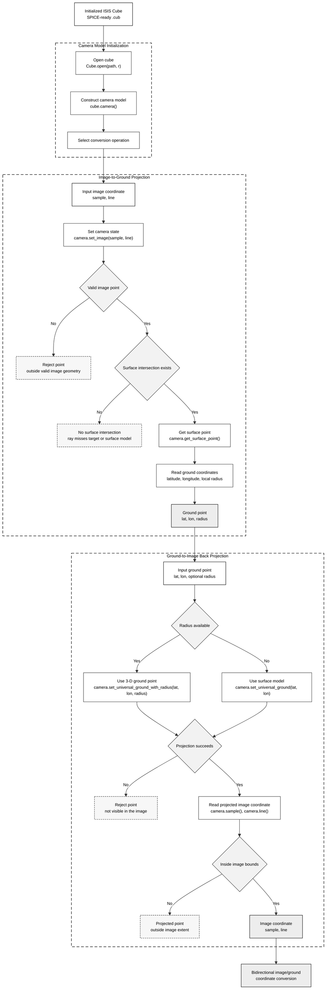

# PyISIS Image/Ground Coordinate Conversion Workflow

```mermaid
%%{init: {"theme": "base", "flowchart": {"htmlLabels": false}, "themeVariables": {"fontFamily": "Times New Roman, serif", "fontSize": "12px", "background": "#FFFFFF", "mainBkg": "#FFFFFF", "primaryColor": "#FFFFFF", "primaryTextColor": "#000000", "primaryBorderColor": "#333333", "lineColor": "#333333", "edgeLabelBackground": "#FFFFFF", "clusterBkg": "#FFFFFF", "clusterBorder": "#333333"}}}%%
flowchart TB
    A["Initialized ISIS Cube<br/>SPICE-ready .cub"] --> B

    subgraph INIT[Camera Model Initialization]
        direction TB
        B["Open cube<br/>Cube.open(path, r)"] --> C["Construct camera model<br/>cube.camera()"]
        C --> D["Select conversion operation"]
    end

    D --> I0

    subgraph IMG2GND[Image-to-Ground Projection]
        direction TB
        I0["Input image coordinate<br/>sample, line"] --> I1["Set camera state<br/>camera.set_image(sample, line)"]
        I1 --> I2{"Valid image point"}
        I2 -->|No| IERR["Reject point<br/>outside valid image geometry"]
        I2 -->|Yes| I3{"Surface intersection exists"}
        I3 -->|No| IERR2["No surface intersection<br/>ray misses target or surface model"]
        I3 -->|Yes| I4["Get surface point<br/>camera.get_surface_point()"]
        I4 --> I5["Read ground coordinates<br/>latitude, longitude, local radius"]
        I5 --> IOUT["Ground point<br/>lat, lon, radius"]
    end

    IOUT --> G0

    subgraph GND2IMG[Ground-to-Image Back Projection]
        direction TB
        G0["Input ground point<br/>lat, lon, optional radius"] --> G1{"Radius available"}
        G1 -->|Yes| G2["Use 3-D ground point<br/>camera.set_universal_ground_with_radius(lat, lon, radius)"]
        G1 -->|No| G3["Use surface model<br/>camera.set_universal_ground(lat, lon)"]
        G2 --> G4{"Projection succeeds"}
        G3 --> G4
        G4 -->|No| GERR["Reject point<br/>not visible in the image"]
        G4 -->|Yes| G5["Read projected image coordinate<br/>camera.sample(), camera.line()"]
        G5 --> G6{"Inside image bounds"}
        G6 -->|No| GERR2["Projected point<br/>outside image extent"]
        G6 -->|Yes| GOUT["Image coordinate<br/>sample, line"]
    end

    GOUT --> Z["Bidirectional image/ground<br/>coordinate conversion"]

    classDef input fill:#FFFFFF,stroke:#000000,stroke-width:1px,color:#000000;
    classDef process fill:#FFFFFF,stroke:#333333,stroke-width:1px,color:#000000;
    classDef decision fill:#F2F2F2,stroke:#333333,stroke-width:1px,color:#000000;
    classDef output fill:#EDEDED,stroke:#000000,stroke-width:1px,color:#000000;
    classDef error fill:#F7F7F7,stroke:#333333,stroke-width:1px,color:#000000,stroke-dasharray:4 2;

    class A,I0,G0 input;
    class B,C,D,I1,I4,I5,G2,G3,G5 process;
    class I2,I3,G1,G4,G6 decision;
    class IOUT,GOUT,Z output;
    class IERR,IERR2,GERR,GERR2 error;
    linkStyle default stroke:#333333,stroke-width:1px;
    style INIT fill:#FFFFFF,stroke:#000000,stroke-width:1.2px,stroke-dasharray:8 5;
    style IMG2GND fill:#FFFFFF,stroke:#000000,stroke-width:1.2px,stroke-dasharray:8 5;
    style GND2IMG fill:#FFFFFF,stroke:#000000,stroke-width:1.2px,stroke-dasharray:8 5;
```
