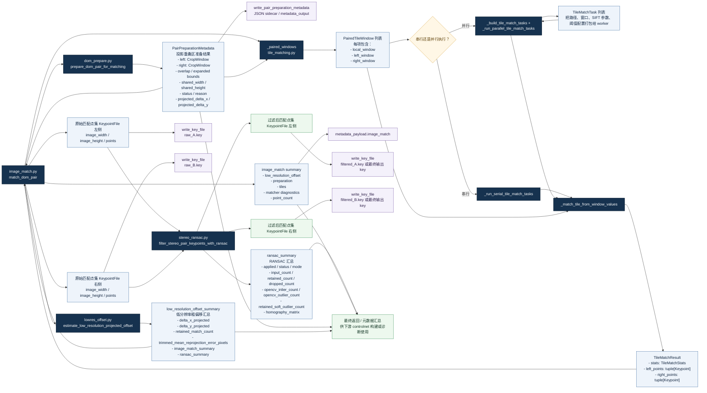

# 子图（c）关键数据结构流转图（Mermaid，中文）

建议论文子图编号：**(c)**

建议中文子图标题：**关键数据结构在匹配管线中的创建、传递与写出关系**

Suggested English panel title: **Creation, Propagation, and Output of Key Data Structures in the Matching Pipeline**

用途：专门展示 `PairPreparationMetadata`、`PairedTileWindow`、`KeypointFile`、`ransac_summary` 等关键对象，
在 `lowres_offset.py`、`dom_prepare.py`、`tile_matching.py`、`stereo_ransac.py` 与 `image_match.py` 之间如何创建、传递与写出。

本三联版统一术语如下：
- “原始匹配点集”统一指 RANSAC 前的 `KeypointFile`；
- “过滤后匹配点集”统一指 RANSAC 后输出的 `KeypointFile`；
- “投影重叠区准备结果”统一指 `PairPreparationMetadata`；
- “RANSAC 汇总”统一指 `ransac_summary`。

说明：
- 本图采用“对象流 / 数据血缘”视角，不强调算法先后，而强调模块之间的输入输出契约。
- 建议作为三联图中的解释性子图，与子图（a）（b）配合使用。
- 图中保留 `metadata_output`、`.key` 文件与最终汇总出口，便于联动调试与论文方法说明。

论文拼图建议：
- 作为三联图的 **(c)** 放置在右侧，承担“解释性补图”角色；
- 若主文版面有限，可放入补充材料或作为 Figure 2 的一部分；
- 导出后推荐在左上角补充角标 “(c)”。
