# 子图（b）整体匹配链路流程图（Mermaid，中文）

建议论文子图编号：**(b)**

建议中文子图标题：**从低分辨率粗偏移到 RANSAC 几何过滤的整体匹配链路**

Suggested English panel title: **End-to-End Matching Pipeline from Coarse Low-Resolution Offset to RANSAC Filtering**

用途：展示 `examples/controlnet_construct/image_match.py` 为核心入口时，
从“低分辨率粗偏移”到“投影重叠区准备”，再到“tile 匹配”与“RANSAC 几何过滤”的完整链路。

本三联版统一术语如下：
- “低分辨率粗偏移”统一指 coarse projected delta；
- “投影重叠区准备”统一指共享工作区估算与窗口映射；
- “原始匹配点集”统一指 tile 汇总后、RANSAC 前的 `KeypointFile`；
- “RANSAC 几何过滤”统一指 `stereo_ransac.py` 中的全局几何一致性筛选。

说明：
- 本图作为三联版的总览子图，侧重模块衔接与阶段边界。
- 图中同时保留关键跳过分支（`skipped_*`）与最终成功输出分支，便于解释 pipeline 行为。
- 若用于 IEEE TGRS 排版，建议导出 SVG 后统一字体、线宽和子图角标。

```mermaid
flowchart TD
    classDef start fill:#16324f,stroke:#0b1f33,color:#ffffff,stroke-width:1.6px;
    classDef stage fill:#eaf1fb,stroke:#4c78a8,color:#10243e,stroke-width:1.2px;
    classDef process fill:#f7fbff,stroke:#6b8fb8,color:#16324f,stroke-width:1px;
    classDef decision fill:#fff7e6,stroke:#d9a441,color:#5a3b00,stroke-width:1.1px;
    classDef data fill:#f4f1fb,stroke:#7a5ea6,color:#2c1e47,stroke-width:1px;
    classDef skip fill:#fff1f0,stroke:#c44536,color:#6b1f17,stroke-width:1px;
    classDef success fill:#edf8ee,stroke:#4f9d69,color:#123524,stroke-width:1.1px;

    A(["开始：match_dom_pair"]):::start --> B["打开左右 DOM Cube<br/>校验 band、matcher 参数、<br/>invalid pixel 相关配置"]:::stage
    B --> C["调用 _estimate_low_resolution_projected_offset<br/>获取低分辨率粗偏移"]:::stage
    C --> D{"低分辨率粗偏移<br/>是否成功且可信？"}:::decision
    D -->|否| D0["采用保守先验：<br/>projected_delta_x = 0<br/>projected_delta_y = 0"]:::skip
    D -->|是| D1["获得 coarse projected delta：<br/>用于修正投影重叠区估算"]:::data
    D0 --> E
    D1 --> E

    E["调用 prepare_dom_pair_for_matching"]:::stage --> F["读取左右 DOM 的投影范围、尺寸与分辨率"]:::process
    F --> G{"左右 DOM 的投影定义<br/>是否兼容？"}:::decision
    G -->|否| G0["preparation.status =<br/>skipped_incompatible_projection"]:::skip
    G -->|是| H["将右图投影范围按 coarse delta 反向平移<br/>在投影坐标系内求真实 overlap"]:::process
    H --> I{"是否存在投影重叠区？"}:::decision
    I -->|否| I0["preparation.status =<br/>skipped_no_projected_overlap"]:::skip
    I -->|是| J["按较粗 GSD × expand_pixels<br/>扩张 overlap 上下文范围"]:::process
    J --> K["将扩张后的投影框<br/>分别映射回 left/right 图像窗口"]:::process
    K --> L["计算 shared_width / shared_height =<br/>左右窗口较小值"]:::process
    L --> M{"共享窗口是否足够大？<br/>大于等于 min_overlap_size"}:::decision
    M -->|否| M0["preparation.status =<br/>skipped_small_overlap"]:::skip
    M -->|是| M1["preparation.status = ready"]:::data

    G0 --> N["windows = []，不进入 tile 匹配"]:::skip
    I0 --> N
    M0 --> N
    M1 --> O["调用 _paired_windows 生成<br/>local / left / right 对应窗口"]:::stage
    O --> P{"共享区域是否需要切块？"}:::decision
    P -->|否| P0["生成单个 full-image paired window"]:::process
    P -->|是| P1["调用 generate_tiles<br/>生成重叠 tile 网格"]:::process
    P0 --> Q
    P1 --> Q

    Q{"是否满足并行条件？<br/>请求并行且 tile>1 且 worker>1"}:::decision
    Q -->|是| Q1["并行执行：<br/>_build_tile_match_tasks +<br/>_run_parallel_tile_match_tasks"]:::stage
    Q -->|否| Q2["串行执行：<br/>_run_serial_tile_match_tasks"]:::stage

    subgraph T1["单个 Tile 匹配流程 / tile_matching.py"]
        direction TD
        R["读取左右 tile 像素窗口"]:::process --> S["统计 valid pixels，<br/>并按 invalid_pixel_radius 扩张无效区"]:::process
        S --> T{"valid_pixel_ratio<br/>达到阈值？"}:::decision
        T -->|否| T0["Tile 跳过：<br/>skipped_valid_pixel_ratio_below_threshold"]:::skip
        T -->|是| U["拉伸为 byte 图像，<br/>生成 SIFT mask"]:::process
        U --> V{"valid_pixel_count<br/>达到 min_valid_pixels？"}:::decision
        V -->|否| V0["Tile 跳过：<br/>skipped_insufficient_valid_pixels"]:::skip
        V -->|是| W["执行 SIFT detectAndCompute"]:::process
        W --> X{"左右两边都提到特征？"}:::decision
        X -->|否| X0["Tile 跳过：<br/>skipped_no_features"]:::skip
        X -->|是| Y["使用 BF / FLANN 做 knnMatch<br/>再做 Lowe ratio test"]:::process
        Y --> Z{"是否保留到有效 matches？"}:::decision
        Z -->|否| Z0["Tile 跳过：<br/>skipped_no_matches"]:::skip
        Z -->|是| AA["将 tile-local OpenCV 坐标<br/>转换为整图 ISIS sample/line"]:::process
        AA --> AB["输出该 tile 的：<br/>原始匹配点集与 TileMatchStats"]:::data
    end

    Q1 --> R
    Q2 --> R
    T0 --> AC["汇总 tile 结果"]:::process
    V0 --> AC
    X0 --> AC
    Z0 --> AC
    AB --> AC

    N --> AD["生成空或部分匹配结果"]:::process
    AC --> AD["拼接全部 tile 的匹配点<br/>构造原始 KeypointFile（左右）"]:::stage
    AD --> AE["构造 summary：<br/>包含 low_resolution_offset、<br/>preparation、tiles、matcher 诊断"]:::data
    AE --> AF["可选：写出 raw key 文件、<br/>metadata 与可视化"]:::stage
    AF --> AG["调用 filter_stereo_pair_keypoints_with_ransac<br/>执行 RANSAC 几何过滤"]:::stage

    AG --> AH{"总匹配点数是否大于等于 4？"}:::decision
    AH -->|否| AH0["ransac_summary.status =<br/>skipped_insufficient_points"]:::skip
    AH -->|是| AI["cv2.findHomography + RANSAC"]:::process
    AI --> AJ{"homography 与 mask<br/>是否成功产生？"}:::decision
    AJ -->|否| AJ0["ransac_summary.status =<br/>skipped_homography_failed"]:::skip
    AJ -->|是| AK["得到 OpenCV inlier mask"]:::process
    AK --> AL{"ransac_mode 是否为 loose？"}:::decision
    AL -->|否| AL0["仅保留 OpenCV inliers"]:::process
    AL -->|是| AM["对 OpenCV outliers 再算 reprojection error<br/>误差足够小的软离群点重新保留"]:::process
    AM --> AL0
    AL0 --> AN["生成过滤后 KeypointFile 与 ransac_summary<br/>包含 homography、保留/剔除统计"]:::success
    AH0 --> AO(["返回匹配结果与 RANSAC 汇总"]):::success
    AJ0 --> AO
    AN --> AO
```

论文拼图建议：
- 作为三联图的 **(b)** 放置在中间，承担主方法总览角色；
- 若版面较紧，可单独作为 Figure 1，而将子图（a）和（c）放入 Figure 2；
- 导出后推荐在左上角补充角标 “(b)”。
