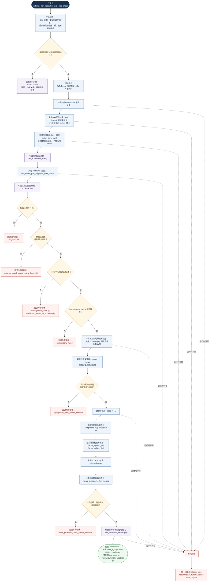

# 子图（a）低分辨率粗偏移估计流程图（Mermaid，中文）

建议论文子图编号：**(a)**

建议中文子图标题：**低分辨率粗偏移估计与可靠性门控流程**

Suggested English panel title: **Coarse Low-Resolution Offset Estimation with Reliability Gating**

用途：展示 `examples/controlnet_construct/lowres_offset.py` 中
`estimate_low_resolution_projected_offset(...)` 的完整主流程、可靠性判定分支与成功出口。

本三联版统一术语如下：
- “低分辨率粗偏移”统一对应 `low_resolution_offset_summary` 中的粗投影平移估计；
- “投影重叠区准备”统一对应 `prepare_dom_pair_for_matching(...)`；
- “原始匹配点集 / 过滤后匹配点集”统一对应 `KeypointFile` 在 RANSAC 前后的状态；
- “回退为零偏移”统一表示 `fallback_zero` 路径。

说明：
- 该版本面向论文子图三联排版，标题、节点句式与其他两图已统一。
- 节点配色采用低饱和蓝/金/红/绿体系，适合后续导出 SVG 后再做 IEEE TGRS 风格排版。
- 可直接复制下方 Mermaid 源码块到支持 Mermaid 的 Markdown 渲染器中使用。

论文拼图建议：
- 作为三联图的 **(a)** 放置在左侧；
- 推荐与子图（b）共享相近宽度，与子图（c）保持相同字体；
- 导出后可在矢量编辑器中添加子图角标 “(a)”。
