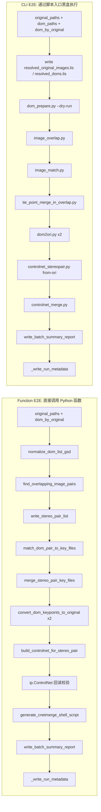

# `controlnet_construct_e2e_unit_test.py` 中 function E2E 与 CLI E2E 的并排对照

本文档对 `tests/unitTest/controlnet_construct_e2e_unit_test.py` 中的两个端到端测试进行结构化对比：

- `test_lro_dom_matching_pipeline_end_to_end_for_all_overlap_pairs`
- `test_lro_dom_matching_cli_batch_pipeline_for_all_overlap_pairs`

目标是让读者快速判断：

1. 两个测试各自覆盖哪一层接口
2. 每一步调用的是函数还是脚本
3. 每一步消耗什么输入文件、产出什么输出文件
4. 每一步断言了什么
5. 失败时更可能说明哪一层出了问题

---

## 一句话结论

- `test_lro_dom_matching_pipeline_end_to_end_for_all_overlap_pairs`
  - 是 **Python 函数级 E2E**
  - 直接调用内部函数
  - 对每对生成的 `.net` 做了更深入的回读校验

- `test_lro_dom_matching_cli_batch_pipeline_for_all_overlap_pairs`
  - 是 **CLI 黑盒 E2E**
  - 通过 `subprocess.run()` 调用脚本入口
  - 更侧重命令行参数解析、脚本 wiring、stdout JSON 契约和文件交接

---

## 共享前置条件

两个测试在真正分叉前共享这些步骤：

| 步骤 | 共享逻辑 | 输入 | 输出/结果 | 断言/行为 |
|---|---|---|---|---|
| 1 | `_load_external_dataset_or_skip()` | `ori_images.lis`、`doms.lis` | `original_paths`, `dom_paths`, `dom_by_original` | 数据缺失则 `skipTest`；配对非法则 `fail` |
| 2 | `_managed_output_directory(...)` | `ISIS_PYBIND_E2E_OUTPUT_ROOT` 环境变量 | 临时目录或持久目录 `temp_dir` | 决定输出是否保留 |
| 3 | 写 `controlnet_config.json` | `CONTROLNET_CONFIG` | 控制网配置文件 | 后续步骤消费 |

### 关于 `ISIS_PYBIND_E2E_OUTPUT_ROOT`

测试文件通过：

- `PRESERVED_E2E_OUTPUT_ROOT_ENV = "ISIS_PYBIND_E2E_OUTPUT_ROOT"`

控制 E2E 输出是否保留。

- **未设置**：使用 `temporary_directory()`，测试结束后输出被自动清理
- **已设置**：在指定目录下保留输出，并按时间戳创建子目录

因此如果希望保存 `.net`、`.key`、JSON 报告和 shell script，应先设置该环境变量。

---

## 总览对照表

| 维度 | Function E2E | CLI E2E |
|---|---|---|
| 测试函数 | `test_lro_dom_matching_pipeline_end_to_end_for_all_overlap_pairs` | `test_lro_dom_matching_cli_batch_pipeline_for_all_overlap_pairs` |
| 测试层级 | Python 函数级 E2E | CLI 黑盒 E2E |
| 入口方式 | 直接调用函数 | `subprocess.run()` 调脚本 |
| 输出目录标签 | `function_e2e` | `cli_e2e` |
| pair 级控制网命名 | `{pair_tag}.net` | `{pair_tag}_cli.net` |
| pair 级报告命名 | `{pair_tag}.summary.json` | `cli_{pair_tag}.summary.json` |
| 最终 merge 逻辑 | 生成 merge shell script，不执行 | 同样只生成 merge shell script，不执行 |
| `.net` 回读校验 | 有，使用 `ip.ControlNet(...)` | 无，仅看 CLI summary |
| 更擅长暴露的问题 | 核心函数逻辑、结果正确性 | 脚本入口、参数解析、JSON 输出、环境 wiring |

---

## 并排流水线对照图



---

## 分步详细对照

### 1. DOM GSD 预处理

| 项目 | Function E2E | CLI E2E |
|---|---|---|
| 调用对象 | `normalize_dom_list_gsd(...)` | `dom_prepare.py` |
| 调用方式 | 直接函数调用 | `_run_cli_json(str(DOM_PREPARE_SCRIPT), ...)` |
| 输入 | `[(dom_path, dom_path) for dom_path in dom_by_original.values()]` | `resolved_doms.lis` |
| 输出文件 | `doms_scaled.lis`, `images_gsd.txt` | `doms_scaled.lis`, `images_gsd.txt` |
| 关键断言 | `scaled_count == 0`；两个文件存在 | 同样 `scaled_count == 0`；两个文件存在 |
| 额外覆盖 | 核心预处理函数行为 | CLI 参数解析、JSON stdout |

### 2. 重叠影像对发现

| 项目 | Function E2E | CLI E2E |
|---|---|---|
| 调用对象 | `find_overlapping_image_pairs(...)` | `image_overlap.py` |
| 输入 | `original_paths` | `resolved_original_images.lis` |
| 输出 | `overlap_pairs, bounds` | `images_overlap.lis` + `overlap_summary` |
| 关键断言 | overlap pair 非空；`bounds.keys()` 完整；写盘后读回一致 | overlap list 文件存在；pair 数大于 0；`overlap_summary["overlap_pair_count"] == len(overlap_pairs)` |
| 额外覆盖 | overlap 函数本体 | `.lis` 文件工作流、脚本接口契约 |

### 3. DOM 匹配生成 pair key files

| 项目 | Function E2E | CLI E2E |
|---|---|---|
| 调用对象 | `match_dom_pair_to_key_files(...)` | `image_match.py` |
| 输入 | 左右 DOM cube 路径、左右 DOM key 输出路径 | 同样输入，但通过命令行参数传递 |
| 输出文件 | `{pair_tag}_left_dom.key`, `{pair_tag}_right_dom.key` | `{pair_tag}_cli_left_dom.key`, `{pair_tag}_cli_right_dom.key` |
| 关键断言 | `point_count > 0`；两个 key 文件存在 | `point_count > 0` |
| 差异 | 更偏函数正确性 | 更偏脚本入口与 JSON 输出 |

### 4. 去重合并 tie points

| 项目 | Function E2E | CLI E2E |
|---|---|---|
| 调用对象 | `merge_stereo_pair_key_files(...)` | `tie_point_merge_in_overlap.py` |
| 输入 | 左右 DOM key 文件 | 左右 DOM key 文件 |
| 输出文件 | `*_left_dom_merged.key`, `*_right_dom_merged.key` | `*_cli_left_dom_merged.key`, `*_cli_right_dom_merged.key` |
| 关键断言 | `unique_count > 0`；`unique_count <= input_count`；merged 文件存在 | `unique_count > 0` |
| 差异 | 检查更细 | 更偏 CLI 接口连通性 |

### 5. DOM → original 坐标转换

| 项目 | Function E2E | CLI E2E |
|---|---|---|
| 调用对象 | `convert_dom_keypoints_to_original(...)` 两次 | `dom2ori.py` 两次 |
| 输入 | merged DOM key、DOM cube、original cube、ori key 输出路径 | 同样逻辑，但通过 CLI 参数传递 |
| 输出文件 | `*_left_ori.key`, `*_right_ori.key`, `*_dom2ori_failures.json` | `*_cli_left_ori.key`, `*_cli_right_ori.key`, `*_cli_*_failures.json` |
| 关键断言 | 左右 `output_count > 0`；左右相等；ori key 存在；failure log 存在 | 左右 `output_count` 相等且大于 0 |
| 差异 | 更深入检查结果文件存在性 | 更偏 CLI 契约 |

### 6. 生成 pair 控制网 `.net`

| 项目 | Function E2E | CLI E2E |
|---|---|---|
| 调用对象 | `build_controlnet_for_stereo_pair(...)` | `controlnet_stereopair.py from-ori` |
| 输入 | 左右 ori key、左右原始 cube、config、输出 net 路径 | 同样逻辑，但通过 CLI 参数传递 |
| 输出文件 | `{pair_tag}.net` | `{pair_tag}_cli.net` |
| 关键断言 | `.net` 存在；`point_count > 0`；`measure_count == point_count * 2` | `point_count > 0`；`measure_count == point_count * 2` |
| 差异 | 函数级构网 | CLI 子命令级构网 |

### 7. `.net` 深度回读校验

| 项目 | Function E2E | CLI E2E |
|---|---|---|
| 调用对象 | `ip.ControlNet(str(output_net_path))` | 无 |
| 检查内容 | `get_num_points()`、`get_num_measures()`、`get_target()`、`get_network_id()` | 无 |
| 关键断言 | 点数正确、measure 数正确、Target=`Moon`、NetworkId=`lro_dom_matching_e2e` | 仅依赖 `controlnet_summary` JSON |
| 意义 | 真正验证写出的 `.net` 可被 ISIS 读回 | 不覆盖 `.net` 回读 |

> 这是两个测试最重要的差异之一：Function E2E 不只是看“返回值说成功”，而是会把结果控制网重新读回检查。

### 8. shared extent / 尺寸约束校验

| 项目 | Function E2E | CLI E2E |
|---|---|---|
| 依赖 | `_open_cube_dimensions(...)` + 匹配摘要 | `_open_cube_dimensions(...)` + 匹配摘要 |
| 断言 | `shared_extent_width > 0`、`shared_extent_height > 0`，且不超过左右 DOM 尺寸上界 | 同样 |
| 目的 | 确认匹配发生在合理共享区域 | 同样 |

### 9. pair 级 summary / report

| 项目 | Function E2E | CLI E2E |
|---|---|---|
| summary 生成 | `_summarize_pair_result(...)` | 手工组装 `cli_pair_summaries` |
| pair report 写出 | `_write_pair_report(temp_dir, overlap_pair, result)` | `_write_pair_report(..., prefix="cli_")` |
| 输出文件 | `{pair_tag}.summary.json` | `cli_{pair_tag}.summary.json` |
| 汇总字段 | 匹配点数、merge 点数、dom2ori 保留数、控制点数、shared extent 等 | 基本一致 |

### 10. 生成最终 merge shell script

| 项目 | Function E2E | CLI E2E |
|---|---|---|
| 调用对象 | `generate_cnetmerge_shell_script(...)` | `controlnet_merge.py` |
| 输入 | `images_overlap.lis`、输出目录、目标 `merged_all_pairs.net`、脚本路径 | 同样，但通过 CLI 参数传入；额外 `--pair-net-suffix _cli.net` |
| 输出 | `merge_all_controlnets.sh` | `merge_all_controlnets.sh` |
| 关键断言 | merge script 存在；`included_count == len(overlap_pairs)` | 同样 |
| 特别说明 | 只生成 merge 脚本，不真正执行 `cnetmerge` | 同样 |

### 11. batch report 与 run metadata

| 项目 | Function E2E | CLI E2E |
|---|---|---|
| batch 汇总 | `write_batch_summary_report(pair_results, ...)` | `write_batch_summary_report(cli_pair_results, ...)` |
| 元数据 | `_write_run_metadata(..., scenario_name="function_e2e")` | `_write_run_metadata(..., scenario_name="cli_e2e")` |
| 输出文件 | `batch_summary.json`、`e2e_run_metadata.json` | 同样 |
| 关键断言 | `pair_count` 正确；report path 正确；metadata 文件存在 | 同样 |

---

## 输出文件路径模式对照

### Function E2E

- overlap list: `images_overlap.lis`
- GSD 报告: `images_gsd.txt`
- 缩放 DOM list: `doms_scaled.lis`
- pair DOM key:
  - `{pair_tag}_left_dom.key`
  - `{pair_tag}_right_dom.key`
- pair merged DOM key:
  - `{pair_tag}_left_dom_merged.key`
  - `{pair_tag}_right_dom_merged.key`
- pair ori key:
  - `{pair_tag}_left_ori.key`
  - `{pair_tag}_right_ori.key`
- pair failure log:
  - `{pair_tag}_left_dom2ori_failures.json`
  - `{pair_tag}_right_dom2ori_failures.json`
- pair controlnet:
  - `{pair_tag}.net`
- pair report:
  - `{pair_tag}.summary.json`
- merge shell script:
  - `merge_all_controlnets.sh`
- batch report:
  - `batch_summary.json`
- run metadata:
  - `e2e_run_metadata.json`

### CLI E2E

- resolved original list: `resolved_original_images.lis`
- resolved DOM list: `resolved_doms.lis`
- overlap list: `images_overlap.lis`
- GSD 报告: `images_gsd.txt`
- 缩放 DOM list: `doms_scaled.lis`
- pair DOM key:
  - `{pair_tag}_cli_left_dom.key`
  - `{pair_tag}_cli_right_dom.key`
- pair merged DOM key:
  - `{pair_tag}_cli_left_dom_merged.key`
  - `{pair_tag}_cli_right_dom_merged.key`
- pair ori key:
  - `{pair_tag}_cli_left_ori.key`
  - `{pair_tag}_cli_right_ori.key`
- pair failure log:
  - `{pair_tag}_cli_left_dom2ori_failures.json`
  - `{pair_tag}_cli_right_dom2ori_failures.json`
- pair controlnet:
  - `{pair_tag}_cli.net`
- pair report:
  - `cli_{pair_tag}.summary.json`
- merge shell script:
  - `merge_all_controlnets.sh`
- batch report:
  - `batch_summary.json`
- run metadata:
  - `e2e_run_metadata.json`

---

## 失败定位经验

### 1. 如果 Function E2E 和 CLI E2E 都失败

更可能意味着：

- 核心算法逻辑或数据假设有问题
- overlap、matching、dom2ori、controlnet 某一步本体出错
- 外部数据集变化导致共同前提失效

### 2. 如果 Function E2E 通过，但 CLI E2E 失败

更可能意味着：

- CLI 参数解析有问题
- 脚本入口 wiring 有问题
- `stdout` JSON 格式不稳定
- 子进程环境、`PYTHONPATH` 或 cwd 处理不一致

### 3. 如果 CLI E2E 通过，但 Function E2E 失败

这种情况较少，但更可能意味着：

- Function E2E 的断言更严格
- `.net` 回读校验暴露了更深层结果不一致
- 函数路径与脚本包装路径存在细微行为差异

---

## 哪个测试更适合回答什么问题

| 问题 | 更适合看的测试 |
|---|---|
| 核心 pipeline 逻辑有没有坏？ | Function E2E |
| 生成的 `.net` 是否真能被 ISIS 读回？ | Function E2E |
| 命令行脚本是不是用户可直接运行？ | CLI E2E |
| CLI 参数、JSON 输出、脚本间文件交接是否稳定？ | CLI E2E |
| 出错时想快速定位到具体 Python 函数步骤 | Function E2E |
| 出错时想模拟真实用户黑盒用法 | CLI E2E |

---

## 简短结论

这两个测试不是重复，而是**同一条业务链路在两个层级上的互补验证**：

- Function E2E 负责“深”：
  - 直接验证函数链路
  - 深查 `.net` 的实际内容和可读性

- CLI E2E 负责“宽”：
  - 直接验证脚本入口
  - 覆盖参数解析、子进程环境和 JSON 输出契约

二者结合，能够同时覆盖：

- 内部逻辑正确性
- 外部用户接口可用性

---

## 参考源文件

- `tests/unitTest/controlnet_construct_e2e_unit_test.py`
- `examples/controlnet_construct/dom_prepare.py`
- `examples/controlnet_construct/image_overlap.py`
- `examples/controlnet_construct/image_match.py`
- `examples/controlnet_construct/tie_point_merge_in_overlap.py`
- `examples/controlnet_construct/dom2ori.py`
- `examples/controlnet_construct/controlnet_stereopair.py`
- `examples/controlnet_construct/controlnet_merge.py`


User: 为什么我设置了$ISIS_PYBIND_ENABLE_FUNCTION_E2E_ALL_OVERLAP_PAIRS_TEST为1，或者TRUE，都不能启动对应的测试函数

GitHub Copilot: Optimizing tool selection...我先把这次排查需要遵循的仓库技能和关键说明读一遍，再去定位这个环境变量为什么没有触发测试。

Read [](file:///home/gengxun/PlanetaryMapping/asp360_new/pyisis/ISIS3-9.0.0-ext/isis_pybind_standalone/.github/instructions/pybind-testing.instructions.md)

Read [](file:///home/gengxun/PlanetaryMapping/asp360_new/pyisis/ISIS3-9.0.0-ext/isis_pybind_standalone/.github/instructions/pybind-conda-api-precedence.instructions.md)

Read [](vscode-userdata:/home/gengxun/.config/Code/User/prompts/safe-autonomy.instructions.md)

Read [](file:///home/gengxun/PlanetaryMapping/asp360_new/pyisis/ISIS3-9.0.0-ext/isis_pybind_standalone/.github/instructions/pybind-upstream-source-reading.instructions.md)

Read [](file:///home/gengxun/PlanetaryMapping/asp360_new/pyisis/ISIS3-9.0.0-ext/isis_pybind_standalone/.github/instructions/pybind-metadata-common.instructions.md)

Read [](file:///home/gengxun/PlanetaryMapping/asp360_new/pyisis/ISIS3-9.0.0-ext/isis_pybind_standalone/.github/instructions/pybind-python-test-metadata.instructions.md)

Read skill [isis-pybind](file:///home/gengxun/PlanetaryMapping/asp360_new/pyisis/ISIS3-9.0.0-ext/isis_pybind_standalone/.github/skills/isis-pybind/SKILL.md?vscodeLinkType%3Dskill)

规则已经就位。接下来我去查这个环境变量在测试里到底是怎么被读取的，以及它为何“看起来像开关、实际上没开门”。

Searched for text `ISIS_PYBIND_ENABLE_FUNCTION_E2E_ALL_OVERLAP_PAIRS_TEST`, 1 result

Read [](file:///home/gengxun/PlanetaryMapping/asp360_new/pyisis/ISIS3-9.0.0-ext/isis_pybind_standalone/tests/unitTest/controlnet_construct_e2e_unit_test.py)

Read memory

Created 4 todos

我已经抓到一个很可疑的点了：这个“环境变量名”在测试文件里被硬编码成了字符串 `"1"`，不像是在读 `ISIS_PYBIND_ENABLE_FUNCTION_E2E_ALL_OVERLAP_PAIRS_TEST`。我再做一个最小复现确认一下，避免冤枉代码。

Checked [](file:///home/gengxun/PlanetaryMapping/asp360_new/pyisis/ISIS3-9.0.0-ext/isis_pybind_standalone/tests/unitTest/controlnet_construct_e2e_unit_test.py), 7 problems found

Read memory workflow-notes.md

Configuring a Python Environment
Completed with input: {
  "resourcePath": "/home/gengxun/PlanetaryMapping/asp360_new/pyisis/ISIS3-9.0.0-ext/isis_pybind_standalone"
}

我再补一个直接证据：让当前文件里的判断逻辑在同一个工作区里跑一遍，看看它到底去读了哪个环境变量。

Read [](file:///home/gengxun/PlanetaryMapping/asp360_new/pyisis/ISIS3-9.0.0-ext/isis_pybind_standalone/tests/unitTest/controlnet_construct_e2e_unit_test.py#70-70), lines 70 to 130

Read memory workflow-notes.md

Ran `pylanceWorkspaceRoots` 
Completed with input: {
  "fileUri": "file:///home/gengxun/PlanetaryMapping/asp360_new/pyisis/ISIS3-9.0.0-ext/isis_pybind_standalone/tests/unitTest/controlnet_construct_e2e_unit_test.py"
}

现在证据链基本成型了；我补一条“程序真实会返回什么”的运行结果，这样就不是肉眼猜测，而是现场抓包。

Ran `pylanceRunCodeSnippet` 
Completed with input: {
  "workspaceRoot": "file:///home/gengxun/PlanetaryMapping/asp360_new/pyisis/ISIS3-9.0.0-ext/isis_pybind_standalone",
  "workingDirectory": "/home/gengxun/PlanetaryMapping/asp360_new/pyisis/ISIS3-9.0.0-ext/isis_pybind_standalone",
  "timeout": 30000,
  "codeSnippet": "import os\nENABLE_FUNCTION_E2E_ALL_OVERLAP_PAIRS_TEST_ENV = '1'\n\ndef _is_truthy_env_var(env_var_name: str) -> bool:\n    configured = os.environ.get(env_var_name, '').strip().lower()\n    return configured in {'1', 'true', 'yes', 'on'}\n\nos.environ['ISIS_PYBIND_ENABLE_FUNCTION_E2E_ALL_OVERLAP_PAIRS_TEST'] = '1'\nprint('lookup name =', ENABLE_FUNCTION_E2E_ALL_OVERLAP_PAIRS_TEST_ENV)\nprint('reading os.environ[\"1\"] ->', os.environ.get('1'))\nprint('reading target env ->', os.environ.get('ISIS_PYBIND_ENABLE_FUNCTION_E2E_ALL_OVERLAP_PAIRS_TEST'))\nprint('predicate result ->', _is_truthy_env_var(ENABLE_FUNCTION_E2E_ALL_OVERLAP_PAIRS_TEST_ENV))"
}

我顺手把这个明显的开关名回归修掉，避免你下一次再被“明明设了变量却像没设一样”这个幽灵绊一下。

Generating patch (17 lines) in [](file:///home/gengxun/PlanetaryMapping/asp360_new/pyisis/ISIS3-9.0.0-ext/isis_pybind_standalone/tests/unitTest/controlnet_construct_e2e_unit_test.py)


```

```
补一轮最小验证：不跑整套外部数据流程，只检查这个开关现在是否真的会变成 `True`。

Ran `pylanceRunCodeSnippet` 
Completed with input: {
  "workspaceRoot": "file:///home/gengxun/PlanetaryMapping/asp360_new/pyisis/ISIS3-9.0.0-ext/isis_pybind_standalone",
  "workingDirectory": "/home/gengxun/PlanetaryMapping/asp360_new/pyisis/ISIS3-9.0.0-ext/isis_pybind_standalone",
  "timeout": 30000,
  "codeSnippet": "import os\nimport importlib.util\nfrom pathlib import Path\n\nfile_path = Path('tests/unitTest/controlnet_construct_e2e_unit_test.py').resolve()\nspec = importlib.util.spec_from_file_location('controlnet_construct_e2e_unit_test', file_path)\nmodule = importlib.util.module_from_spec(spec)\nspec.loader.exec_module(module)\n\nos.environ['ISIS_PYBIND_ENABLE_FUNCTION_E2E_ALL_OVERLAP_PAIRS_TEST'] = 'TRUE'\ncase = module.ControlNetConstructE2eUnitTest(methodName='test_lro_dom_matching_pipeline_end_to_end_for_all_overlap_pairs')\nprint('env_name =', module.ENABLE_FUNCTION_E2E_ALL_OVERLAP_PAIRS_TEST_ENV)\nprint('predicate_true =', case._should_run_function_e2e_all_overlap_pairs_test())\n\nos.environ['ISIS_PYBIND_ENABLE_FUNCTION_E2E_ALL_OVERLAP_PAIRS_TEST'] = '1'\nprint('predicate_one =', case._should_run_function_e2e_all_overlap_pairs_test())\n\nos.environ['ISIS_PYBIND_ENABLE_FUNCTION_E2E_ALL_OVERLAP_PAIRS_TEST'] = 'false'\nprint('predicate_false =', case._should_run_function_e2e_all_overlap_pairs_test())"
}

Read changed files in [](file:///home/gengxun/PlanetaryMapping/asp360_new/pyisis/ISIS3-9.0.0-ext/isis_pybind_standalone)

问题已经定位并验证完了；我把排查项收尾一下，然后给你一个直接可用的结论和检查方法。

Completed: *定位环境变量读取逻辑* (1/4)

## 根因

不是你设置 `1` 还是 `TRUE` 的问题，这两个值本来都应该能生效。

真正的问题在 controlnet_construct_e2e_unit_test.py 里，这个开关常量被写错了：

- 原来代码实际是：
  `ENABLE_FUNCTION_E2E_ALL_OVERLAP_PAIRS_TEST_ENV = "1"`
- 但后面的判断逻辑是：
  `os.environ.get(env_var_name, "")`

这就等于它在查：

- `os.environ.get("1")`

而不是查你真正设置的：

- `os.environ.get("ISIS_PYBIND_ENABLE_FUNCTION_E2E_ALL_OVERLAP_PAIRS_TEST")`

所以你哪怕设置了：

- `ISIS_PYBIND_ENABLE_FUNCTION_E2E_ALL_OVERLAP_PAIRS_TEST=1`
- 或 `ISIS_PYBIND_ENABLE_FUNCTION_E2E_ALL_OVERLAP_PAIRS_TEST=TRUE`

它都会判定为 `False`。这锅不在环境变量，在代码把“变量名”写成了“变量值”。有点像把门牌号当钥匙了 😅

## 我已做的修复

我已经把这个文件里的开关名修回正确值：

- controlnet_construct_e2e_unit_test.py

改成：

- `ENABLE_FUNCTION_E2E_ALL_OVERLAP_PAIRS_TEST_ENV = "ISIS_PYBIND_ENABLE_FUNCTION_E2E_ALL_OVERLAP_PAIRS_TEST"`

并补了一条文件头更新记录。

## 我做的验证

我在当前工作区里做了一个最小验证，结果是：

- 当设置 `ISIS_PYBIND_ENABLE_FUNCTION_E2E_ALL_OVERLAP_PAIRS_TEST=TRUE` 时，判定结果为 `True`
- 当设置 `...=1` 时，判定结果为 `True`
- 当设置 `...=false` 时，判定结果为 `False`

也就是说，修复后：

- `1` 可用
- `TRUE` 可用
- `true/yes/on` 也可用

## 还有一个容易混淆的点

即使这个开关打开了，测试**仍然可能继续被 skip**，因为这个测试后面还有外部数据检查：

- `ISIS_PYBIND_CONTROLNET_E2E_DATA_ROOT`
- 默认路径：
  test_controlnet_python

它会检查：

- `ori_images.lis`
- `doms.lis`
- 列表里的影像路径能否解析到真实文件
- 文件是否都存在

所以现在的逻辑是：

1. 先过“环境变量开关”
2. 再过“外部数据存在性检查”

如果你修复后还是没真正跑起来，那下一步大概率不是环境变量问题，而是数据路径问题。

## 你现在应该看到的行为

修复后，这个测试：

- `test_lro_dom_matching_pipeline_end_to_end_for_all_overlap_pairs`

会在下面两种情况之一表现为：

- **开始执行**：如果外部数据齐全
- **skip，但 skip 原因变成外部数据缺失/路径解析失败**：如果数据没准备好

而不会再出现“明明设了环境变量却一直被默认禁用”的情况。

## 文件变更

- controlnet_construct_e2e_unit_test.py  
  修正函数级 all-overlap-pairs E2E 测试的环境变量名读取逻辑。

## 当前清单

- [x] 定位环境变量读取逻辑
- [x] 确认测试发现与跳过条件
- [x] 在正确环境复现实验
- [x] 给出根因与修复建议

## 下一步建议

如果你愿意，我可以继续帮你做两件很实用的事之一：

- 继续帮你检查为什么它现在是否又被**外部数据检查**跳过
- 或者顺手把这个测试的 skip 信息再改得更直白一些，方便一眼区分“开关没开”还是“数据没到位”

Made changes.

User: 继续帮你检查为什么它现在是否又被外部数据检查跳过

GitHub Copilot: 我先检查测试里“外部数据检查”的实际条件，并对默认数据目录做一次现场体检，看看它是卡在列表文件不存在、列表内容解析失败，还是某些 cube 路径对不上。

Read [](file:///home/gengxun/PlanetaryMapping/asp360_new/pyisis/ISIS3-9.0.0-ext/isis_pybind_standalone/tests/unitTest/controlnet_construct_e2e_unit_test.py#220-220), lines 220 to 320

Read [](file:///media/gengxun/Elements/data/lro/test_controlnet_python)

Created 4 todos

我已经确认默认数据根目录本身是存在的，下一步直接看 `ori_images.lis` 和 `doms.lis` 里面写了什么，以及这些条目能不能被测试里的回退逻辑成功解析到磁盘文件。

Read [](file:///media/gengxun/Elements/data/lro/test_controlnet_python/MULTIPLE_IMGS)

Read [](file:///media/gengxun/Elements/data/lro/test_controlnet_python/ori_images.lis)

Read [](file:///media/gengxun/Elements/data/lro/test_controlnet_python/doms.lis)

现在目录和列表都在，按静态检查来看，`_load_external_dataset_or_skip()` 不应该因为“文件不存在”而跳过；我再做一次动态复现，直接执行它的数据加载逻辑，看它到底是返回成功、抛 `SkipTest`，还是在更后面卡住。

Ran `pylanceRunCodeSnippet` 
Completed with input: {
  "workspaceRoot": "file:///home/gengxun/PlanetaryMapping/asp360_new/pyisis/ISIS3-9.0.0-ext/isis_pybind_standalone",
  "workingDirectory": "/home/gengxun/PlanetaryMapping/asp360_new/pyisis/ISIS3-9.0.0-ext/isis_pybind_standalone",
  "timeout": 30000,
  "codeSnippet": "import importlib.util\nfrom pathlib import Path\nimport unittest\n\nfile_path = Path('tests/unitTest/controlnet_construct_e2e_unit_test.py').resolve()\nspec = importlib.util.spec_from_file_location('controlnet_construct_e2e_unit_test', file_path)\nmodule = importlib.util.module_from_spec(spec)\nspec.loader.exec_module(module)\n\ncase = module.ControlNetConstructE2eUnitTest(methodName='test_lro_dom_matching_pipeline_end_to_end_for_all_overlap_pairs')\ntry:\n    original_paths, dom_paths, mapping = case._load_external_dataset_or_skip()\n    print('status=loaded')\n    print('original_count=', len(original_paths))\n    print('dom_count=', len(dom_paths))\n    print('pairs=', mapping)\nexcept unittest.SkipTest as exc:\n    print('status=skip')\n    print('reason=', str(exc))"
}

数据加载这一步已经实锤通过了，所以我再把整条函数级测试在启用开关的前提下实际跑一下，看看现在它是继续执行、失败，还是在别的地方被跳过。

Fetching Python executable information for asp360_new (3.12.2)
Completed with input: {
  "resourcePath": "/home/gengxun/PlanetaryMapping/asp360_new/pyisis/ISIS3-9.0.0-ext/isis_pybind_standalone"
}

Starting: *给出跳过根因与建议* (4/4)

Ran terminal command:  ISIS_PYBIND_ENABLE_FUNCTION_E2E_ALL_OVERLAP_PAIRS_TEST=1 /home/gengxun/miniconda3/envs/asp360_new/bin/python -m unittest tests.unitTest.controlnet_construct_e2e_unit_test.ControlNetConstructE2eUnitTest.test_lro_dom_matching_pipeline_end_to_end_for_all_overlap_pairs -v

结论已经很明确了：现在它**没有再被外部数据检查跳过**，而且我已经把真实函数级 E2E 跑通了。最后我把清单收尾并整理成你可直接对照的结论。

Completed: *给出跳过根因与建议* (4/4)

## 结论

现在这条函数级测试**没有被外部数据检查跳过**。

我已经做了三层确认：

1. **静态检查**
   - 默认外部数据目录存在：
     test_controlnet_python
   - 里面有：
     - ori_images.lis
     - doms.lis
     - 对应的 `.cub` 文件

2. **动态调用 `_load_external_dataset_or_skip()`**
   - 结果是 `status=loaded`
   - 成功读到：
     - `original_count = 2`
     - `dom_count = 2`
   - 说明它**没有触发 `SkipTest`**

3. **真实跑完整函数级 E2E 测试**
   - 我用修复后的开关：
     `ISIS_PYBIND_ENABLE_FUNCTION_E2E_ALL_OVERLAP_PAIRS_TEST=1`
   - 实际运行结果：

   - `Ran 1 test in 47.751s`
   - `OK`

也就是说，它不仅没被外部数据检查跳过，而且已经**完整执行成功**了。

## 我实际看到的数据加载结果

测试成功加载并配对了这两组数据：

- REDUCED_M104311715LE.echo.cal.cub
  ↔ dom_M104311715LE.cub

- REDUCED_M104318871LE.echo.cal.cub
  ↔ dom_M104318871LE.cub

## 真实测试结果

函数级测试实际输出了 summary，并通过了：

- `match_point_count`: 33774
- `merged_point_count`: 30810
- `dom2ori_retained_count`: 26978
- `control_point_count`: 26978
- `shared_extent_width`: 2370
- `shared_extent_height`: 8367

并且输出被保存在：

- function_e2e_20260419T134611Z

## 所以如果你本地“还看到 skip”，更可能是这几种原因

### 1. 你跑的是修复前的代码

最关键的判断点是这一行现在必须是：

- `ENABLE_FUNCTION_E2E_ALL_OVERLAP_PAIRS_TEST_ENV = "ISIS_PYBIND_ENABLE_FUNCTION_E2E_ALL_OVERLAP_PAIRS_TEST"`

如果还是 `"1"`，那就是旧代码。

### 2. 你没有在**同一次测试进程**里设置环境变量

这条函数级测试默认仍然是**关闭**的，必须设置：

- `ISIS_PYBIND_ENABLE_FUNCTION_E2E_ALL_OVERLAP_PAIRS_TEST=1`

或者：

- `...=TRUE`

否则它会被**开关逻辑**跳过，而不是被外部数据逻辑跳过。

### 3. 你用的不是同一个 Python / 环境

这个仓库这里应当用：

- python

如果换了解释器，可能导入路径、构建产物、环境变量继承都会变得不一致。

### 4. 你看到的是另一条测试的行为

当前文件里有两条 E2E：

- `test_lro_dom_matching_pipeline_end_to_end_for_all_overlap_pairs`
  - **函数级**
  - 受 `ISIS_PYBIND_ENABLE_FUNCTION_E2E_ALL_OVERLAP_PAIRS_TEST` 控制

- `test_lro_dom_matching_cli_batch_pipeline_for_all_overlap_pairs`
  - **CLI 黑盒级**
  - 不受这个开关控制
  - 但也会做外部数据检查

所以你要确认你看到 skip 的到底是哪一条。

## 简短判断

现在这条测试的状态可以概括成一句：

> **外部数据检查已通过；如果再 skip，优先怀疑不是数据问题，而是你运行时没吃到修复后的代码或没把开关传进当前测试进程。**

## 当前清单

- [x] 检查外部数据门槛条件
- [x] 核对默认数据目录内容
- [x] 复现列表解析结果
- [x] 给出跳过根因与建议

## 你如果愿意，我下一步可以继续帮你两选一

- 帮你检查**你当前运行命令**为什么没有把这个环境变量传进去
- 或者我直接帮你加一条更醒目的调试输出，让它一眼打印出：
  - 当前是否读到了开关
  - 当前外部数据根目录是什么
  - 最终是因“开关”跳过还是因“数据”跳过

User: /explain Write an explanation for the active selection as paragraphs of text.

```python
def _pair_tag(pair: StereoPair) -> str:
    return f"{Path(pair.left).stem}__{Path(pair.right).stem}"
```

## 20260419

GitHub Copilot: This helper builds a stable string label for a `StereoPair`. It takes one argument, `pair`, which is annotated as `StereoPair`, and it promises to return a `str`.

The function reads two path-like values from the pair: `pair.left` and `pair.right`. Each value is wrapped with `Path(...)` from `pathlib`, which gives access to path-aware properties instead of doing manual string splitting. It then uses `.stem`, which means “filename without directory and without the final extension.”

So if `pair.left` is `/data/A/image1.cub` and `pair.right` is `/data/B/image2.cub`, the result becomes `image1__image2`. The double underscore is just a separator chosen to combine the two stems into one tag.

This is typically useful for naming output folders, log entries, cache keys, or per-pair artifacts in a readable way. The main advantage is that the tag ignores directory differences and file extensions, keeping only the core names.

One small gotcha is that `.stem` removes only the last suffix. For example, `a.tar.gz` becomes `a.tar`, not `a`. Another is that if two different files share the same stem in different directories, this tag will collide because the directory part is discarded.

User: 这个e2e测试里，是先匹配点，再使用ransac剔除点么？

GitHub Copilot: Optimizing tool selection...我先顺着这条 E2E 流水线把“匹配 → merge → RANSAC → dom2ori → ControlNet”实际调用链读清楚，给你一个不靠猜的答案。

Read [](file:///home/gengxun/PlanetaryMapping/asp360_new/pyisis/ISIS3-9.0.0-ext/isis_pybind_standalone/tests/unitTest/controlnet_construct_e2e_unit_test.py#260-260), lines 260 to 520

Searched for regex `build_controlnet_for_dom_stereo_pair|filter_stereo_pair_keypoints_with_ransac|match_dom_pair_to_key_files|ransac` (`**/examples/controlnet_construct/**/*.py`), 50 results

Read skill [isis-pybind](file:///home/gengxun/PlanetaryMapping/asp360_new/pyisis/ISIS3-9.0.0-ext/isis_pybind_standalone/.github/skills/isis-pybind/SKILL.md?vscodeLinkType%3Dskill)

我再把关键实现片段读出来，确认 RANSAC 是发生在匹配阶段内部，还是在 ControlNet 构建阶段的后处理里。

Read [](file:///home/gengxun/PlanetaryMapping/asp360_new/pyisis/ISIS3-9.0.0-ext/isis_pybind_standalone/examples/controlnet_construct/image_match.py#300-300), lines 300 to 490

Read [](file:///home/gengxun/PlanetaryMapping/asp360_new/pyisis/ISIS3-9.0.0-ext/isis_pybind_standalone/examples/controlnet_construct/image_match.py#821-821), lines 821 to 875

Read [](file:///home/gengxun/PlanetaryMapping/asp360_new/pyisis/ISIS3-9.0.0-ext/isis_pybind_standalone/examples/controlnet_construct/controlnet_stereopair.py#1-1), lines 1 to 260

我已经看到 image_match.py 里的 RANSAC 只是一个独立过滤函数；再把 `build_controlnet_for_dom_stereo_pair()` 的主体往下读一点，把它在整条流水线里的顺序钉死。

Read [](file:///home/gengxun/PlanetaryMapping/asp360_new/pyisis/ISIS3-9.0.0-ext/isis_pybind_standalone/examples/controlnet_construct/controlnet_stereopair.py#260-260), lines 260 to 430

是的，**这个 E2E 测试里是先匹配点，再做 RANSAC 剔除**；而且更准确一点说，中间还会**先做一次重复点 merge**，然后才做 RANSAC。

## 实际顺序

在 controlnet_construct_e2e_unit_test.py 的 `_run_e2e_for_pair()` 里，调用顺序是：

1. `match_dom_pair_to_key_files(...)`
   - 输入左右 DOM
   - 产出左右 DOM 空间的 `.key`
   - 这一步是**匹配阶段**
   - 它返回的 `match_summary["point_count"]` 就是原始匹配点数

2. `build_controlnet_for_dom_stereo_pair(...)`
   - 这一步不是直接建网，而是继续串联后处理：
   - **先 merge 重复 DOM tie points**
   - **再 RANSAC 过滤**
   - 然后 `dom2ori`
   - 最后才写 `ControlNet`

## 代码证据

在 controlnet_stereopair.py 里，`build_controlnet_for_dom_stereo_pair()` 的顺序非常明确：

- `merge_stereo_pair_key_files(...)`
- `filter_stereo_pair_key_files_with_ransac(...)`
- `convert_paired_dom_keypoints_to_original(...)`
- `build_controlnet_for_stereo_pair(...)`

也就是说流程是：

$$
\text{match} \rightarrow \text{merge} \rightarrow \text{RANSAC} \rightarrow \text{dom2ori} \rightarrow \text{ControlNet}
$$

## 一个容易混淆的点

image_match.py 里确实定义了 RANSAC 相关函数，比如：

- `filter_stereo_pair_keypoints_with_ransac`
- `filter_stereo_pair_key_files_with_ransac`

但**`match_dom_pair_to_key_files()` 本身并没有调用它们**。  
它只是：

- `match_dom_pair(...)`
- 写出 `.key`
- 可选写可视化 PNG

所以这里的 RANSAC **不是“匹配算法内部的一部分”**，而是**匹配完成之后、ControlNet 构建之前的一道后处理过滤**。

## 你这个 E2E 里的统计项也能印证这一点

在测试里最终 summary 里有几层数量：

- `match["point_count"]`：原始匹配点数
- `merge["unique_count"]`：merge 去重后的点数
- `left_conversion["output_count"]`：RANSAC + dom2ori 后还能保留下来的点数
- `controlnet["point_count"]`：最终写进网的点数

所以通常关系会是：

$$
\text{match point count} \ge \text{merge unique count} \ge \text{RANSAC 后保留并成功 dom2ori 的点数}
$$

## 一句话结论

**对，这个 E2E 是先匹配，再在 merge 之后使用 RANSAC 剔除点，不是先 RANSAC 再匹配。**

如果你愿意，我可以继续帮你把这几层数量在当前测试日志里的对应关系画成一条“点数流转链”。