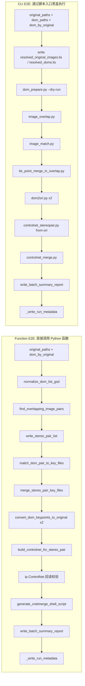

# `controlnet_construct_e2e_unit_test.py` 中 function E2E 与 CLI E2E 的并排对照

本文档对 `tests/unitTest/controlnet_construct_e2e_unit_test.py` 中的两个端到端测试进行结构化对比：

- `test_lro_dom_matching_pipeline_end_to_end_for_all_overlap_pairs`
- `test_lro_dom_matching_cli_batch_pipeline_for_all_overlap_pairs`

目标是让读者快速判断：

1. 两个测试各自覆盖哪一层接口
2. 每一步调用的是函数还是脚本
3. 每一步消耗什么输入文件、产出什么输出文件
4. 每一步断言了什么
5. 失败时更可能说明哪一层出了问题

---

## 一句话结论

- `test_lro_dom_matching_pipeline_end_to_end_for_all_overlap_pairs`
  - 是 **Python 函数级 E2E**
  - 直接调用内部函数
  - 对每对生成的 `.net` 做了更深入的回读校验

- `test_lro_dom_matching_cli_batch_pipeline_for_all_overlap_pairs`
  - 是 **CLI 黑盒 E2E**
  - 通过 `subprocess.run()` 调用脚本入口
  - 更侧重命令行参数解析、脚本 wiring、stdout JSON 契约和文件交接

---

## 共享前置条件

两个测试在真正分叉前共享这些步骤：

| 步骤 | 共享逻辑 | 输入 | 输出/结果 | 断言/行为 |
|---|---|---|---|---|
| 1 | `_load_external_dataset_or_skip()` | `ori_images.lis`、`doms.lis` | `original_paths`, `dom_paths`, `dom_by_original` | 数据缺失则 `skipTest`；配对非法则 `fail` |
| 2 | `_managed_output_directory(...)` | `ISIS_PYBIND_E2E_OUTPUT_ROOT` 环境变量 | 临时目录或持久目录 `temp_dir` | 决定输出是否保留 |
| 3 | 写 `controlnet_config.json` | `CONTROLNET_CONFIG` | 控制网配置文件 | 后续步骤消费 |

### 关于 `ISIS_PYBIND_E2E_OUTPUT_ROOT`

测试文件通过：

- `PRESERVED_E2E_OUTPUT_ROOT_ENV = "ISIS_PYBIND_E2E_OUTPUT_ROOT"`

控制 E2E 输出是否保留。

- **未设置**：使用 `temporary_directory()`，测试结束后输出被自动清理
- **已设置**：在指定目录下保留输出，并按时间戳创建子目录

因此如果希望保存 `.net`、`.key`、JSON 报告和 shell script，应先设置该环境变量。

---

## 总览对照表

| 维度 | Function E2E | CLI E2E |
|---|---|---|
| 测试函数 | `test_lro_dom_matching_pipeline_end_to_end_for_all_overlap_pairs` | `test_lro_dom_matching_cli_batch_pipeline_for_all_overlap_pairs` |
| 测试层级 | Python 函数级 E2E | CLI 黑盒 E2E |
| 入口方式 | 直接调用函数 | `subprocess.run()` 调脚本 |
| 输出目录标签 | `function_e2e` | `cli_e2e` |
| pair 级控制网命名 | `{pair_tag}.net` | `{pair_tag}_cli.net` |
| pair 级报告命名 | `{pair_tag}.summary.json` | `cli_{pair_tag}.summary.json` |
| 最终 merge 逻辑 | 生成 merge shell script，不执行 | 同样只生成 merge shell script，不执行 |
| `.net` 回读校验 | 有，使用 `ip.ControlNet(...)` | 无，仅看 CLI summary |
| 更擅长暴露的问题 | 核心函数逻辑、结果正确性 | 脚本入口、参数解析、JSON 输出、环境 wiring |

---

## 并排流水线对照图

---

## 分步详细对照

### 1. DOM GSD 预处理

| 项目 | Function E2E | CLI E2E |
|---|---|---|
| 调用对象 | `normalize_dom_list_gsd(...)` | `dom_prepare.py` |
| 调用方式 | 直接函数调用 | `_run_cli_json(str(DOM_PREPARE_SCRIPT), ...)` |
| 输入 | `[(dom_path, dom_path) for dom_path in dom_by_original.values()]` | `resolved_doms.lis` |
| 输出文件 | `doms_scaled.lis`, `images_gsd.txt` | `doms_scaled.lis`, `images_gsd.txt` |
| 关键断言 | `scaled_count == 0`；两个文件存在 | 同样 `scaled_count == 0`；两个文件存在 |
| 额外覆盖 | 核心预处理函数行为 | CLI 参数解析、JSON stdout |

### 2. 重叠影像对发现

| 项目 | Function E2E | CLI E2E |
|---|---|---|
| 调用对象 | `find_overlapping_image_pairs(...)` | `image_overlap.py` |
| 输入 | `original_paths` | `resolved_original_images.lis` |
| 输出 | `overlap_pairs, bounds` | `images_overlap.lis` + `overlap_summary` |
| 关键断言 | overlap pair 非空；`bounds.keys()` 完整；写盘后读回一致 | overlap list 文件存在；pair 数大于 0；`overlap_summary["overlap_pair_count"] == len(overlap_pairs)` |
| 额外覆盖 | overlap 函数本体 | `.lis` 文件工作流、脚本接口契约 |

### 3. DOM 匹配生成 pair key files

| 项目 | Function E2E | CLI E2E |
|---|---|---|
| 调用对象 | `match_dom_pair_to_key_files(...)` | `image_match.py` |
| 输入 | 左右 DOM cube 路径、左右 DOM key 输出路径 | 同样输入，但通过命令行参数传递 |
| 输出文件 | `{pair_tag}_left_dom.key`, `{pair_tag}_right_dom.key` | `{pair_tag}_cli_left_dom.key`, `{pair_tag}_cli_right_dom.key` |
| 关键断言 | `point_count > 0`；两个 key 文件存在 | `point_count > 0` |
| 差异 | 更偏函数正确性 | 更偏脚本入口与 JSON 输出 |

### 4. 去重合并 tie points

| 项目 | Function E2E | CLI E2E |
|---|---|---|
| 调用对象 | `merge_stereo_pair_key_files(...)` | `tie_point_merge_in_overlap.py` |
| 输入 | 左右 DOM key 文件 | 左右 DOM key 文件 |
| 输出文件 | `*_left_dom_merged.key`, `*_right_dom_merged.key` | `*_cli_left_dom_merged.key`, `*_cli_right_dom_merged.key` |
| 关键断言 | `unique_count > 0`；`unique_count <= input_count`；merged 文件存在 | `unique_count > 0` |
| 差异 | 检查更细 | 更偏 CLI 接口连通性 |

### 5. DOM → original 坐标转换

| 项目 | Function E2E | CLI E2E |
|---|---|---|
| 调用对象 | `convert_dom_keypoints_to_original(...)` 两次 | `dom2ori.py` 两次 |
| 输入 | merged DOM key、DOM cube、original cube、ori key 输出路径 | 同样逻辑，但通过 CLI 参数传递 |
| 输出文件 | `*_left_ori.key`, `*_right_ori.key`, `*_dom2ori_failures.json` | `*_cli_left_ori.key`, `*_cli_right_ori.key`, `*_cli_*_failures.json` |
| 关键断言 | 左右 `output_count > 0`；左右相等；ori key 存在；failure log 存在 | 左右 `output_count` 相等且大于 0 |
| 差异 | 更深入检查结果文件存在性 | 更偏 CLI 契约 |

### 6. 生成 pair 控制网 `.net`

| 项目 | Function E2E | CLI E2E |
|---|---|---|
| 调用对象 | `build_controlnet_for_stereo_pair(...)` | `controlnet_stereopair.py from-ori` |
| 输入 | 左右 ori key、左右原始 cube、config、输出 net 路径 | 同样逻辑，但通过 CLI 参数传递 |
| 输出文件 | `{pair_tag}.net` | `{pair_tag}_cli.net` |
| 关键断言 | `.net` 存在；`point_count > 0`；`measure_count == point_count * 2` | `point_count > 0`；`measure_count == point_count * 2` |
| 差异 | 函数级构网 | CLI 子命令级构网 |

### 7. `.net` 深度回读校验

| 项目 | Function E2E | CLI E2E |
|---|---|---|
| 调用对象 | `ip.ControlNet(str(output_net_path))` | 无 |
| 检查内容 | `get_num_points()`、`get_num_measures()`、`get_target()`、`get_network_id()` | 无 |
| 关键断言 | 点数正确、measure 数正确、Target=`Moon`、NetworkId=`lro_dom_matching_e2e` | 仅依赖 `controlnet_summary` JSON |
| 意义 | 真正验证写出的 `.net` 可被 ISIS 读回 | 不覆盖 `.net` 回读 |

> 这是两个测试最重要的差异之一：Function E2E 不只是看“返回值说成功”，而是会把结果控制网重新读回检查。

### 8. shared extent / 尺寸约束校验

| 项目 | Function E2E | CLI E2E |
|---|---|---|
| 依赖 | `_open_cube_dimensions(...)` + 匹配摘要 | `_open_cube_dimensions(...)` + 匹配摘要 |
| 断言 | `shared_extent_width > 0`、`shared_extent_height > 0`，且不超过左右 DOM 尺寸上界 | 同样 |
| 目的 | 确认匹配发生在合理共享区域 | 同样 |

### 9. pair 级 summary / report

| 项目 | Function E2E | CLI E2E |
|---|---|---|
| summary 生成 | `_summarize_pair_result(...)` | 手工组装 `cli_pair_summaries` |
| pair report 写出 | `_write_pair_report(temp_dir, overlap_pair, result)` | `_write_pair_report(..., prefix="cli_")` |
| 输出文件 | `{pair_tag}.summary.json` | `cli_{pair_tag}.summary.json` |
| 汇总字段 | 匹配点数、merge 点数、dom2ori 保留数、控制点数、shared extent 等 | 基本一致 |

### 10. 生成最终 merge shell script

| 项目 | Function E2E | CLI E2E |
|---|---|---|
| 调用对象 | `generate_cnetmerge_shell_script(...)` | `controlnet_merge.py` |
| 输入 | `images_overlap.lis`、输出目录、目标 `merged_all_pairs.net`、脚本路径 | 同样，但通过 CLI 参数传入；额外 `--pair-net-suffix _cli.net` |
| 输出 | `merge_all_controlnets.sh` | `merge_all_controlnets.sh` |
| 关键断言 | merge script 存在；`included_count == len(overlap_pairs)` | 同样 |
| 特别说明 | 只生成 merge 脚本，不真正执行 `cnetmerge` | 同样 |

### 11. batch report 与 run metadata

| 项目 | Function E2E | CLI E2E |
|---|---|---|
| batch 汇总 | `write_batch_summary_report(pair_results, ...)` | `write_batch_summary_report(cli_pair_results, ...)` |
| 元数据 | `_write_run_metadata(..., scenario_name="function_e2e")` | `_write_run_metadata(..., scenario_name="cli_e2e")` |
| 输出文件 | `batch_summary.json`、`e2e_run_metadata.json` | 同样 |
| 关键断言 | `pair_count` 正确；report path 正确；metadata 文件存在 | 同样 |

---

## 输出文件路径模式对照

### Function E2E

- overlap list: `images_overlap.lis`
- GSD 报告: `images_gsd.txt`
- 缩放 DOM list: `doms_scaled.lis`
- pair DOM key:
  - `{pair_tag}_left_dom.key`
  - `{pair_tag}_right_dom.key`
- pair merged DOM key:
  - `{pair_tag}_left_dom_merged.key`
  - `{pair_tag}_right_dom_merged.key`
- pair ori key:
  - `{pair_tag}_left_ori.key`
  - `{pair_tag}_right_ori.key`
- pair failure log:
  - `{pair_tag}_left_dom2ori_failures.json`
  - `{pair_tag}_right_dom2ori_failures.json`
- pair controlnet:
  - `{pair_tag}.net`
- pair report:
  - `{pair_tag}.summary.json`
- merge shell script:
  - `merge_all_controlnets.sh`
- batch report:
  - `batch_summary.json`
- run metadata:
  - `e2e_run_metadata.json`

### CLI E2E

- resolved original list: `resolved_original_images.lis`
- resolved DOM list: `resolved_doms.lis`
- overlap list: `images_overlap.lis`
- GSD 报告: `images_gsd.txt`
- 缩放 DOM list: `doms_scaled.lis`
- pair DOM key:
  - `{pair_tag}_cli_left_dom.key`
  - `{pair_tag}_cli_right_dom.key`
- pair merged DOM key:
  - `{pair_tag}_cli_left_dom_merged.key`
  - `{pair_tag}_cli_right_dom_merged.key`
- pair ori key:
  - `{pair_tag}_cli_left_ori.key`
  - `{pair_tag}_cli_right_ori.key`
- pair failure log:
  - `{pair_tag}_cli_left_dom2ori_failures.json`
  - `{pair_tag}_cli_right_dom2ori_failures.json`
- pair controlnet:
  - `{pair_tag}_cli.net`
- pair report:
  - `cli_{pair_tag}.summary.json`
- merge shell script:
  - `merge_all_controlnets.sh`
- batch report:
  - `batch_summary.json`
- run metadata:
  - `e2e_run_metadata.json`

---

## 失败定位经验

### 1. 如果 Function E2E 和 CLI E2E 都失败

更可能意味着：

- 核心算法逻辑或数据假设有问题
- overlap、matching、dom2ori、controlnet 某一步本体出错
- 外部数据集变化导致共同前提失效

### 2. 如果 Function E2E 通过，但 CLI E2E 失败

更可能意味着：

- CLI 参数解析有问题
- 脚本入口 wiring 有问题
- `stdout` JSON 格式不稳定
- 子进程环境、`PYTHONPATH` 或 cwd 处理不一致

### 3. 如果 CLI E2E 通过，但 Function E2E 失败

这种情况较少，但更可能意味着：

- Function E2E 的断言更严格
- `.net` 回读校验暴露了更深层结果不一致
- 函数路径与脚本包装路径存在细微行为差异

---

## 哪个测试更适合回答什么问题

| 问题 | 更适合看的测试 |
|---|---|
| 核心 pipeline 逻辑有没有坏？ | Function E2E |
| 生成的 `.net` 是否真能被 ISIS 读回？ | Function E2E |
| 命令行脚本是不是用户可直接运行？ | CLI E2E |
| CLI 参数、JSON 输出、脚本间文件交接是否稳定？ | CLI E2E |
| 出错时想快速定位到具体 Python 函数步骤 | Function E2E |
| 出错时想模拟真实用户黑盒用法 | CLI E2E |

---

## 简短结论

这两个测试不是重复，而是**同一条业务链路在两个层级上的互补验证**：

- Function E2E 负责“深”：
  - 直接验证函数链路
  - 深查 `.net` 的实际内容和可读性

- CLI E2E 负责“宽”：
  - 直接验证脚本入口
  - 覆盖参数解析、子进程环境和 JSON 输出契约

二者结合，能够同时覆盖：

- 内部逻辑正确性
- 外部用户接口可用性

---

## 参考源文件

- `tests/unitTest/controlnet_construct_e2e_unit_test.py`
- `examples/controlnet_construct/dom_prepare.py`
- `examples/controlnet_construct/image_overlap.py`
- `examples/controlnet_construct/image_match.py`
- `examples/controlnet_construct/tie_point_merge_in_overlap.py`
- `examples/controlnet_construct/dom2ori.py`
- `examples/controlnet_construct/controlnet_stereopair.py`
- `examples/controlnet_construct/controlnet_merge.py`
